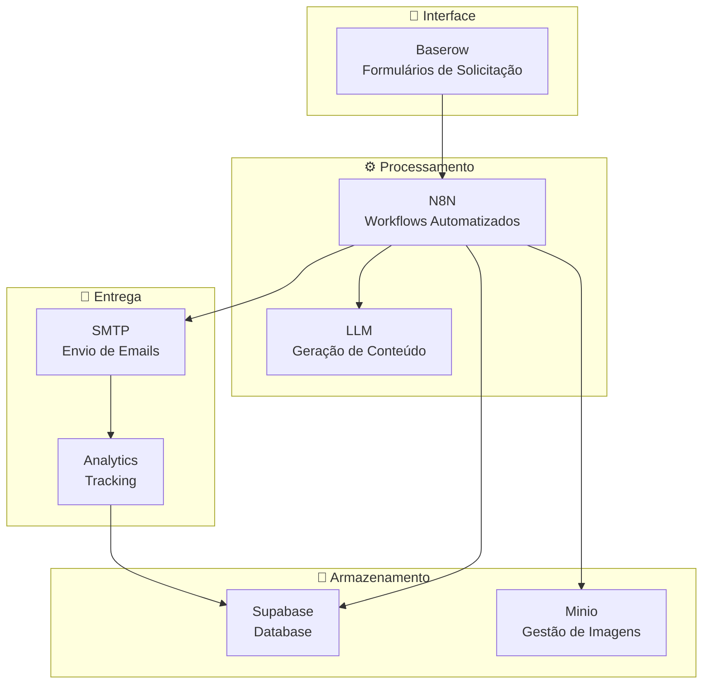
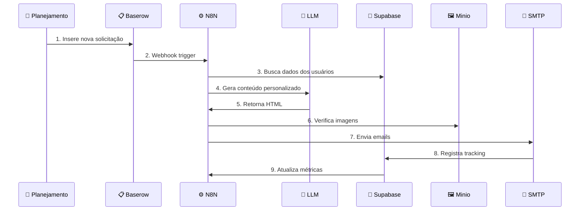
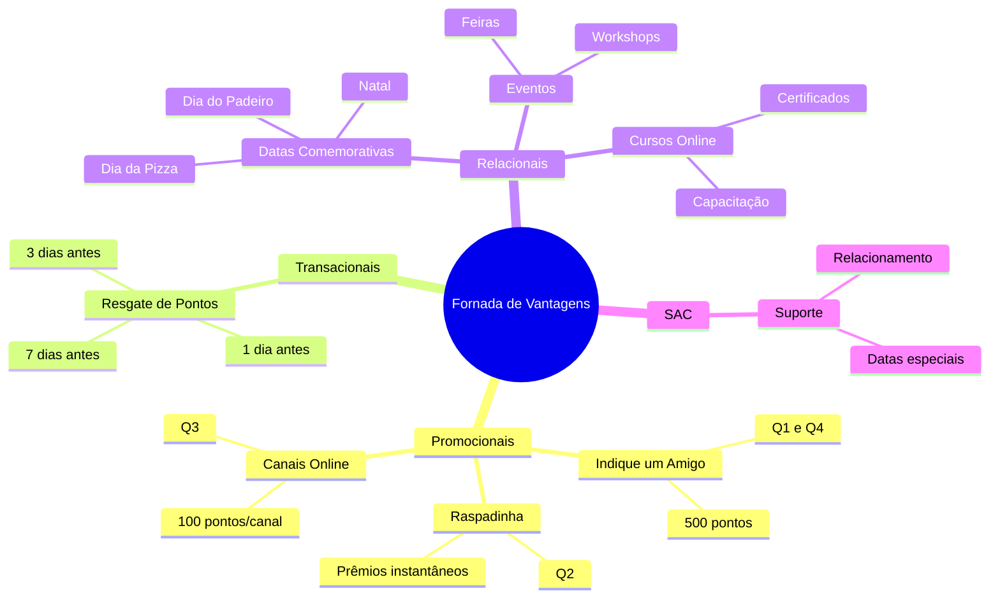

# 🏗️ Arquitetura do Sistema

> **Visão geral dos componentes e fluxo de dados do Gerador Automático de Emails**

📋 **Navegação**: [← Voltar ao README](../README.md) | [Próximo: Histórias de Usuário →](user-stories.md)

---

## 🎯 Visão Geral

O sistema é composto por 4 componentes principais que trabalham em conjunto para automatizar a criação e envio de emails personalizados.

### 🧩 Componentes Principais

---

## 🚀 Fluxo de Dados

### Sequência Completa

---

## 📋 Estrutura de Campanhas

### Mapa Mental das Campanhas

---

## 🔧 Especificações Técnicas

### Stack Tecnológica

| Componente | Tecnologia | Função |
|------------|------------|--------|
| 📋 **Interface** | Baserow | Formulários de solicitação |
| ⚙️ **Automação** | N8N | Workflows e integração |
| 🤖 **IA** | OpenAI GPT | Geração de conteúdo |
| 💾 **Database** | Supabase | Armazenamento de dados |
| 🖼️ **Assets** | Minio | Gestão de imagens |
| 📧 **Email** | SMTP | Envio de emails |
| 📊 **Analytics** | Custom | Tracking e métricas |

### Requisitos de Sistema

- **Largura de banda**: Mínimo 10 Mbps
- **Armazenamento**: 50GB para imagens e templates
- **Processamento**: 4 vCPUs para workflows N8N
- **Memória**: 8GB RAM para processamento

---

## 🔗 Navegação

- 📚 **[← Voltar ao README](../README.md)**
- 👥 **[Próximo: Histórias de Usuário →](user-stories.md)**
- 📋 **[Ver Formulários Baserow →](baserow-forms.md)**
- 🖼️ **[Gestão de Imagens →](image-management.md)**

---

  <strong>📊 Arquitetura | Gerador de Emails Fornada de Vantagens</strong>

 