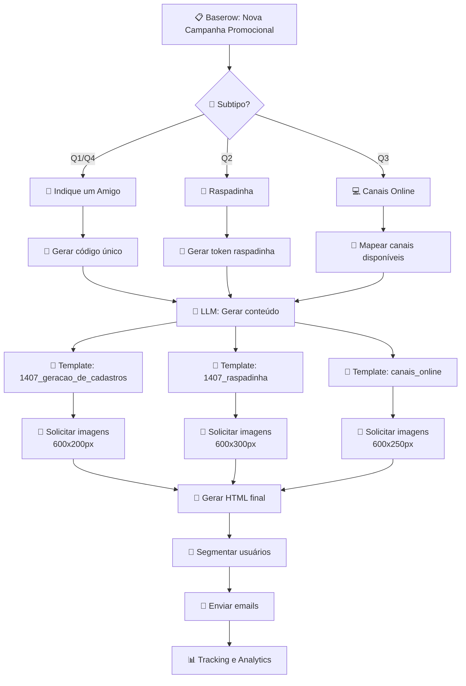
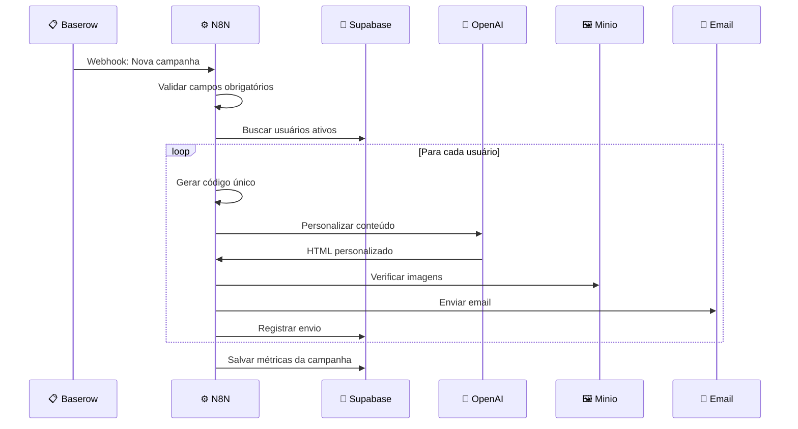
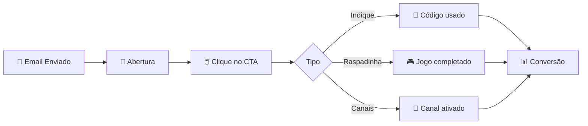

# 🎁 Campanhas Promocionais

> **Indique um amigo, Raspadinha e Canais online - Estratégias de aquisição e engajamento**

📋 **Navegação**: [← Histórias de Usuário](user-stories.md) | [Próximo: Campanhas Transacionais →](campanhas-transacionais.md)

---

## 🎯 Objetivo

Aquisição, engajamento e migração de usuários através de incentivos e gamificação, com rotação trimestral para manter o interesse.

---

## 🔄 Fluxo Geral

---

## 🤝 1. Indique um Amigo (Q1, Q4)

### 📋 Configuração no Baserow

| Campo | Valor | Observações |
|-------|-------|-------------|
| **Tipo** | `Promocional` | |
| **Subtipo** | `indique_amigo` | |
| **Assunto** | `"Indique um amigo e ganhe 500 pontos no Fornada de Vantagens!"` | |
| **Mensagem Principal** | `"Olá {NOME}, que tal ganhar 500 pontos indicando um amigo? Seu amigo também ganha 200 pontos de boas-vindas!"` | |
| **CTA Principal** | `"Indicar Amigo"` | |
| **URL Principal** | `"https://fornadadevantagens.com.br/indique?ref={CODIGO_UNICO}"` | Código único por usuário |
| **Incentivo** | `"500 pontos por indicação convertida"` | |
| **Pontos Oferecidos** | `500` | |
| **Validade** | `"30 dias"` | |
| **Segmento** | `"usuarios_ativos_com_historico"` | |

### ⚙️ Fluxo N8N Específico

### 🎨 Template Base: `1407_geracao_de_cadastros`

**Estrutura HTML:**
- 🖼️ **Header**: Banner principal com logo Bunge
- 📝 **Corpo**: Mensagem personalizada com nome do usuário
- 🎁 **Incentivo**: Destaque para os 500 pontos
- 🔗 **CTA**: Botão "Indicar Amigo" com link único
- 📧 **Footer**: Contatos e redes sociais padrão

**Imagens Necessárias:**
- `banner_indique_amigo.png` (600x200px)
- `cta_indicar.png` (200x50px)

---

## 🎰 2. Raspadinha (Q2)

### 📋 Configuração no Baserow

| Campo | Valor | Observações |
|-------|-------|-------------|
| **Tipo** | `Promocional` | |
| **Subtipo** | `raspadinha` | |
| **Assunto** | `"Raspe e ganhe prêmios instantâneos no Fornada!"` | |
| **Mensagem Principal** | `"Olá {NOME}, que tal raspar e ganhar prêmios instantâneos? Temos eletrodomésticos, vouchers e muito mais!"` | |
| **CTA Principal** | `"Raspar Agora"` | |
| **URL Principal** | `"https://fornadadevantagens.com.br/raspadinha?token={TOKEN_UNICO}"` | Token único por usuário |
| **Segmento** | `"todos_usuarios_ativos"` | |

### 🎨 Template Base: `1407_raspadinha`

**Estrutura HTML:**
- 🖼️ **Header**: Banner com elementos de jogo
- 📝 **Corpo**: Mensagem de gamificação
- 🎮 **Elemento Interativo**: Preview da raspadinha
- 🔗 **CTA**: Botão "Raspar Agora"
- 📧 **Footer**: Padrão

**Imagens Necessárias:**
- `banner_raspadinha.png` (600x300px)
- `elementos_jogo.png` (600x250px)

---

## 💻 3. Canais Online (Q3)

### 📋 Configuração no Baserow

| Campo | Valor | Observações |
|-------|-------|-------------|
| **Tipo** | `Promocional` | |
| **Subtipo** | `canais_online` | |
| **Assunto** | `"Use nossos canais online e ganhe pontos extras!"` | |
| **Mensagem Principal** | `"Olá {NOME}, que tal migrar para nossos canais online? Você ganha pontos extras e tem mais facilidade!"` | |
| **CTA Principal** | `"Conhecer Canais"` | |
| **URL Principal** | `"https://fornadadevantagens.com.br/canais-online"` | |
| **Canais Disponíveis** | `"App, WhatsApp Business, Portal Web"` | |
| **Pontos Extras** | `"100 pontos por canal ativado"` | |
| **Segmento** | `"usuarios_canais_tradicionais"` | |

### 🎨 Template: Novo Específico

**Estrutura HTML:**
- 🖼️ **Header**: Banner com ícones dos canais
- 📝 **Corpo**: Benefícios da migração digital
- 📱 **Canais**: Grid com App, WhatsApp, Portal
- 🔗 **CTA**: Botão "Conhecer Canais"
- 📧 **Footer**: Padrão

**Imagens Necessárias:**
- `banner_canais.png` (600x250px)
- `icons_canais.png` (300x100px)

---

## 📊 Métricas e KPIs

### Indicadores por Campanha

| Campanha | Métrica Principal | Meta | Frequência |
|----------|------------------|------|------------|
| **Indique um Amigo** | Taxa de indicação | 15% | Trimestral |
| **Raspadinha** | Taxa de participação | 45% | Trimestral |
| **Canais Online** | Taxa de migração | 25% | Trimestral |

### Tracking Específico

---

## 🔗 Navegação

- 👥 **[← Histórias de Usuário](user-stories.md)**
- 💳 **[Próximo: Campanhas Transacionais →](campanhas-transacionais.md)**
- 🎉 **[Ver Campanhas Relacionais →](campanhas-relacionais.md)**
- 📋 **[Ver Formulários Baserow →](baserow-forms.md)**

---

  <strong>🎁 Campanhas Promocionais | Gerador de Emails Fornada de Vantagens</strong>

 