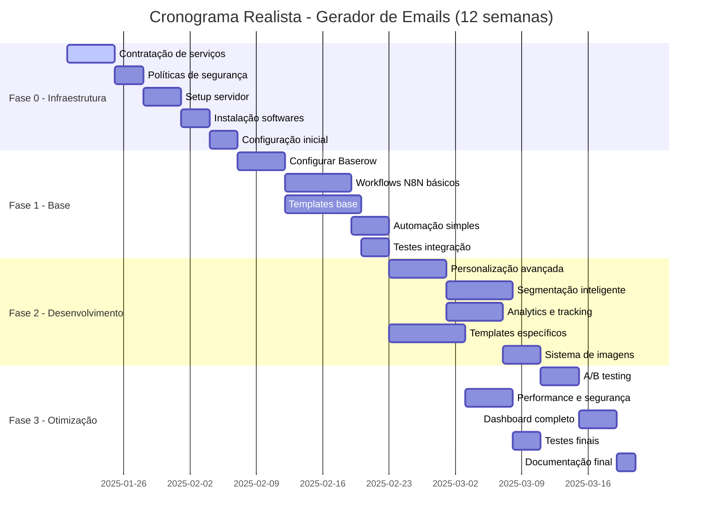
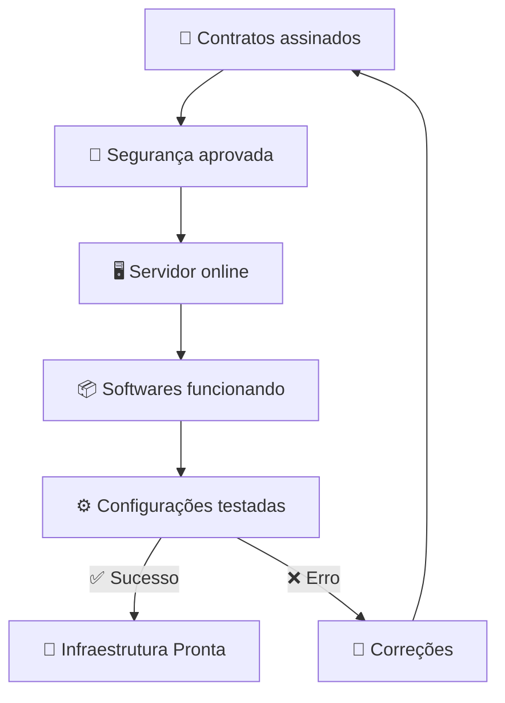
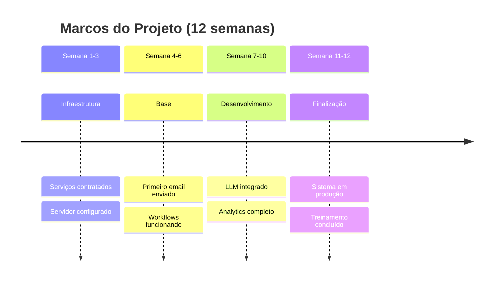
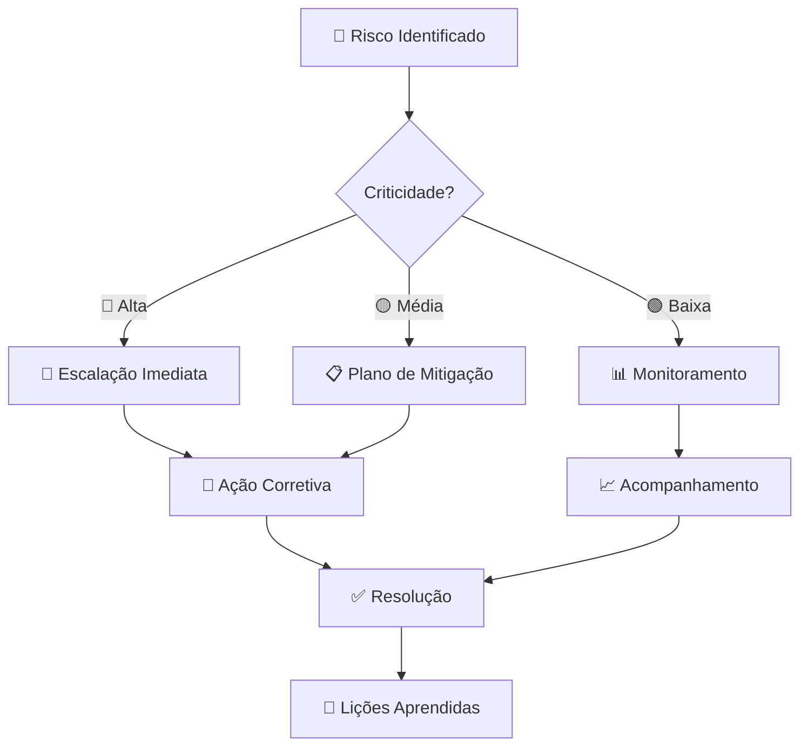

# 📅 Cronograma de Implementação

> **Fases, marcos e entregas do Gerador Automático de Emails**

📋 **Navegação**: [← Campanhas SAC](campanhas-sac.md) | [Próximo: Próximos Passos →](proximos-passos.md)

---

## ⚠️ Material Confidencial

**🔒 CONFIDENCIAL** - Agência Cappuccino → Bunge Profissional

---

## 🎯 Visão Geral

O projeto será desenvolvido em 4 fases principais ao longo de **12 semanas** (3 meses), considerando que **apenas 1 desenvolvedor** trabalhará no projeto, incluindo toda a infraestrutura, contratações e adequações de segurança.

---

## 📊 Cronograma Gantt

---

## 🏗️ Fase 0: Infraestrutura e Contratações (3 semanas)

### 🎯 Objetivo
Estabelecer toda a infraestrutura necessária, contratar serviços e adequar às políticas de segurança da Bunge.

### 📋 Entregas

| Entrega | Descrição | Responsável | Prazo |
|---------|-----------|-------------|-------|
| **💼 Contratação de Serviços** | Supabase, OpenAI, SMTP, Minio, servidor | Mario | 5 dias |
| **🔐 Políticas de Segurança** | Adequação às normas da Bunge | Mario | 3 dias |
| **🖥️ Setup Servidor** | Configuração servidor de produção | Mario | 4 dias |
| **📦 Instalação de Softwares** | N8N, Docker, SSL, monitoramento | Mario | 3 dias |
| **⚙️ Configuração Inicial** | Redes, DNS, backup, segurança | Mario | 3 dias |

### ✅ Critérios de Aceitação

- [ ] 💳 **Todos os serviços contratados** e pagamentos aprovados
- [ ] 🔒 **Políticas de segurança** validadas pela Bunge
- [ ] 🖥️ **Servidor configurado** com SSL e monitoramento
- [ ] 📦 **Softwares instalados** e funcionando
- [ ] 🔄 **Backup automático** configurado
- [ ] 📊 **Logs e monitoramento** operacionais

### 🧪 Validação da Fase 0

---

## 🏗️ Fase 1: Base (3 semanas)

### 🎯 Objetivo
Desenvolver as funcionalidades core do sistema com infraestrutura já estabelecida.

### 📋 Entregas

| Entrega | Descrição | Responsável | Prazo |
|---------|-----------|-------------|-------|
| **🔧 Baserow Setup** | Configuração completa dos formulários | Mario | 5 dias |
| **⚙️ N8N Workflows** | Workflows básicos para cada tipo de campanha | Mario | 7 dias |
| **🎨 Templates HTML** | Templates funcionais baseados nos existentes | Mario | 8 dias |
| **📧 SMTP Config** | Configuração de envio de emails | Mario | 4 dias |
| **🧪 Testes Integração** | Testes end-to-end básicos | Mario | 3 dias |

### ✅ Critérios de Aceitação

- [ ] ✅ **Baserow aceita** formulários de todas as campanhas
- [ ] ⚙️ **N8N processa** solicitações automaticamente
- [ ] 🎨 **Templates geram** HTML válido
- [ ] 📧 **Emails são enviados** com sucesso
- [ ] 📊 **Logs básicos** funcionam
- [ ] 🔐 **Segurança básica** implementada

---

## ⚡ Fase 2: Desenvolvimento Avançado (4 semanas)

### 🎯 Objetivo
Implementar personalização avançada, segmentação inteligente e sistema completo de imagens.

### 📋 Entregas

| Entrega | Descrição | Responsável | Prazo |
|---------|-----------|-------------|-------|
| **🤖 LLM Integration** | Geração de conteúdo personalizado | Mario | 6 dias |
| **🎯 Segmentação** | Sistema de segmentação automática | Mario | 7 dias |
| **📊 Analytics** | Tracking de abertura e clique | Mario | 6 dias |
| **🎨 Templates Avançados** | Templates específicos por campanha | Mario | 8 dias |
| **🖼️ Sistema de Imagens** | Gestão completa de assets | Mario | 4 dias |

### ✅ Critérios de Aceitação

- [ ] 🤖 **LLM gera** conteúdo personalizado
- [ ] 🎯 **Segmentação automática** funciona
- [ ] 📊 **Métricas são coletadas** corretamente
- [ ] 🎨 **Todos os tipos** de campanha têm templates
- [ ] 🖼️ **Sistema de imagens** funciona
- [ ] 🔒 **Segurança avançada** implementada

### 📊 Métricas da Fase 2

| Métrica | Meta | Método de Medição |
|---------|------|-------------------|
| **Personalização** | 100% emails personalizados | Verificação automática |
| **Segmentação** | 95% precisão | Validação manual |
| **Performance** | < 3min por email | Logs de tempo |
| **Qualidade HTML** | 100% válido | Validador W3C |
| **Uptime** | 99.5% disponibilidade | Monitoramento |

---

## 🚀 Fase 3: Otimização e Finalização (2 semanas)

### 🎯 Objetivo
Otimizar performance, implementar A/B testing, finalizar documentação e preparar para produção.

### 📋 Entregas

| Entrega | Descrição | Responsável | Prazo |
|---------|-----------|-------------|-------|
| **🧪 A/B Testing** | Sistema de testes A/B | Mario | 4 dias |
| **🚀 Performance** | Otimizações e segurança | Mario | 5 dias |
| **📈 Dashboard** | Interface de monitoramento | Mario | 4 dias |
| **🧪 Testes Finais** | Testes de carga e segurança | Mario | 3 dias |
| **📋 Documentação** | Manual completo e treinamento | Mario | 2 dias |

### ✅ Critérios de Aceitação

- [ ] 🧪 **A/B testing** funciona para campanhas
- [ ] 🚀 **Sistema suporta** 5k emails/hora
- [ ] 📈 **Dashboard mostra** métricas em tempo real
- [ ] 🔄 **Sistema é resiliente** a falhas
- [ ] 📋 **Documentação completa** e treinamento
- [ ] 🔐 **Auditoria de segurança** aprovada

---

## 🎯 Marcos e Entregas

### 📊 Resumo Executivo

| Fase | Duração | Entregas Principais | Status |
|------|---------|-------------------|--------|
| **🏗️ Fase 0** | 3 semanas | • Infraestrutura completa • Serviços contratados • Segurança aprovada | 🔄 Planejamento |
| **🏗️ Fase 1** | 3 semanas | • Baserow configurado • N8N workflows básicos • Templates funcionais | ⏳ Aguardando |
| **⚡ Fase 2** | 4 semanas | • Personalização completa • Analytics implementado • Sistema de imagens | ⏳ Aguardando |
| **🚀 Fase 3** | 2 semanas | • A/B testing • Dashboard completo • Sistema otimizado | ⏳ Aguardando |

### 🏆 Marcos Críticos

---

## 🔍 Critérios de Sucesso

### 📈 KPIs do Projeto

| KPI | Meta | Medição |
|-----|------|---------|
| **⏱️ Tempo de Criação** | -70% vs manual | Comparação temporal |
| **📧 Taxa de Abertura** | +30% vs atual | Analytics de email |
| **🎯 Taxa de Conversão** | +25% vs atual | Tracking de campanhas |
| **💰 Redução de Custos** | -50% vs atual | Análise financeira |
| **🚀 Performance** | 5k emails/hora | Teste de carga |
| **⏱️ Uptime** | 99.5% disponibilidade | Monitoramento 24/7 |

### ✅ Definição de Pronto

Uma funcionalidade está "pronta" quando:

1. ✅ **Desenvolvida** e testada individualmente
2. 🔄 **Integrada** com outros componentes
3. 📋 **Documentada** adequadamente
4. 🧪 **Testada** em ambiente de staging
5. 🔐 **Aprovada** em auditoria de segurança
6. ✅ **Validada** pelo stakeholder
7. 🚢 **Deployada** em produção

---

## ⚠️ Riscos e Mitigações

### 🚨 Riscos Identificados

| Risco | Probabilidade | Impacto | Mitigação |
|-------|---------------|---------|-----------|
| **🔧 Complexidade N8N** | Média | Alto | Prototipagem prévia + 2 semanas extra |
| **🤖 Limites da API LLM** | Baixa | Médio | Fallback manual + múltiplos provedores |
| **📧 Deliverability** | Baixa | Alto | Testes com múltiplos provedores |
| **⏰ Atraso no cronograma** | Média | Médio | Buffer de 1 semana por fase |
| **🔐 Aprovação segurança** | Alta | Alto | Início antecipado das validações |
| **💰 Orçamento serviços** | Baixa | Médio | Contingência de 20% |
| **👤 Sobrecarga desenvolvedor** | Alta | Alto | Cronograma realista + pausas |

### 🛡️ Plano de Contingência

---

## 💰 Estimativa de Custos

### 📊 Custos por Fase

| Fase | Duração | Custos Infra | Custos Dev | Total |
|------|---------|--------------|------------|-------|
| **Fase 0** | 3 semanas | R$ 2.500 | R$ 9.000 | R$ 11.500 |
| **Fase 1** | 3 semanas | R$ 1.800 | R$ 9.000 | R$ 10.800 |
| **Fase 2** | 4 semanas | R$ 2.400 | R$ 12.000 | R$ 14.400 |
| **Fase 3** | 2 semanas | R$ 1.200 | R$ 6.000 | R$ 7.200 |
| **Total** | **12 semanas** | **R$ 7.900** | **R$ 36.000** | **R$ 43.900** |

### 💳 Serviços a Contratar

| Serviço | Custo Mensal | Observações |
|---------|--------------|-------------|
| **Servidor VPS** | R$ 200 | 4 vCPUs, 8GB RAM |
| **Supabase Pro** | R$ 150 | Database + Auth |
| **OpenAI API** | R$ 300 | GPT-4 para LLM |
| **SMTP SendGrid** | R$ 100 | 50k emails/mês |
| **Minio Storage** | R$ 80 | 100GB armazenamento |
| **SSL Certificate** | R$ 20 | Certificado anual |
| **Monitoramento** | R$ 50 | Uptime + logs |

---

## 🔗 Navegação

- 🎧 **[← Campanhas SAC](campanhas-sac.md)**
- ✅ **[Próximo: Próximos Passos →](proximos-passos.md)**
- 📚 **[Voltar ao README](../README.md)**
- 🏗️ **[Ver Arquitetura →](arquitetura.md)**

---

  <strong>📅 Cronograma Realista | Gerador de Emails Fornada de Vantagens</strong> 
  <small>🔒 Material Confidencial - Mario Campello para Agência Cappuccino</small>

 