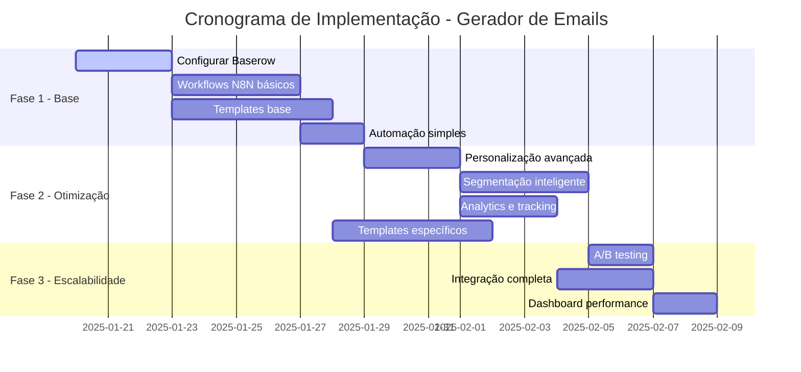
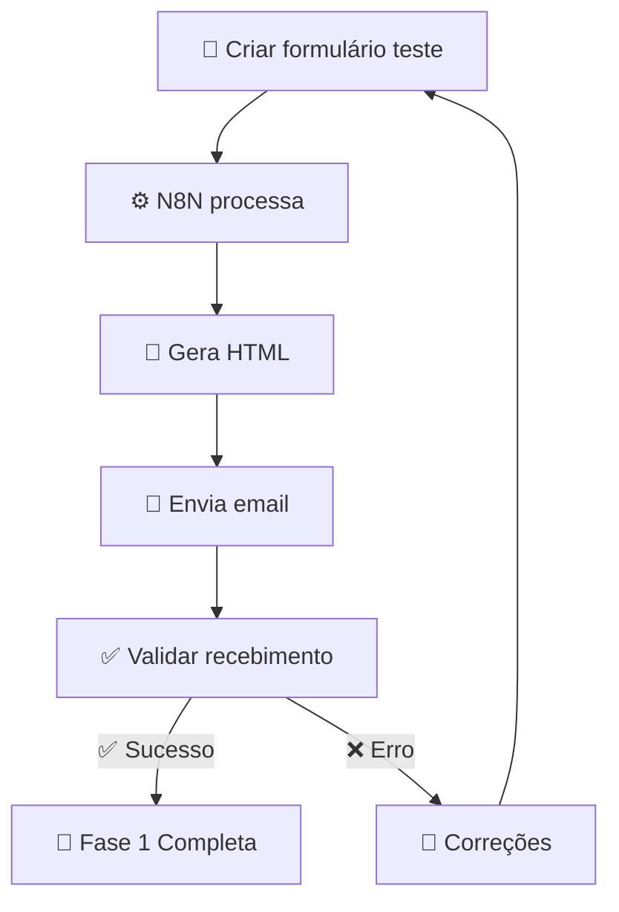
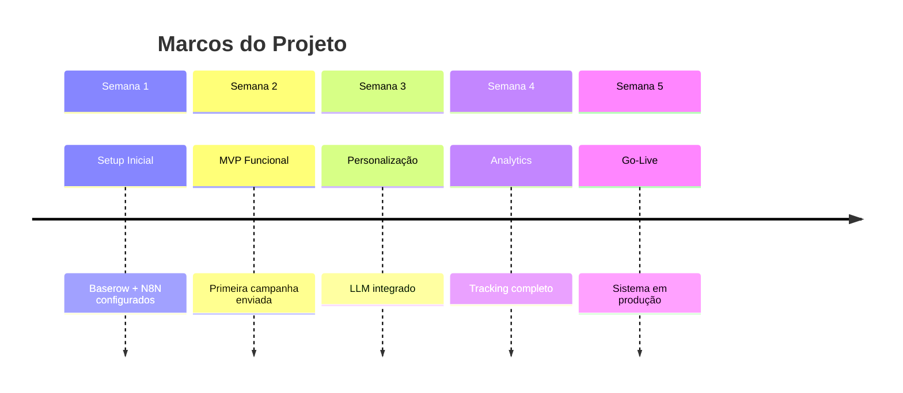
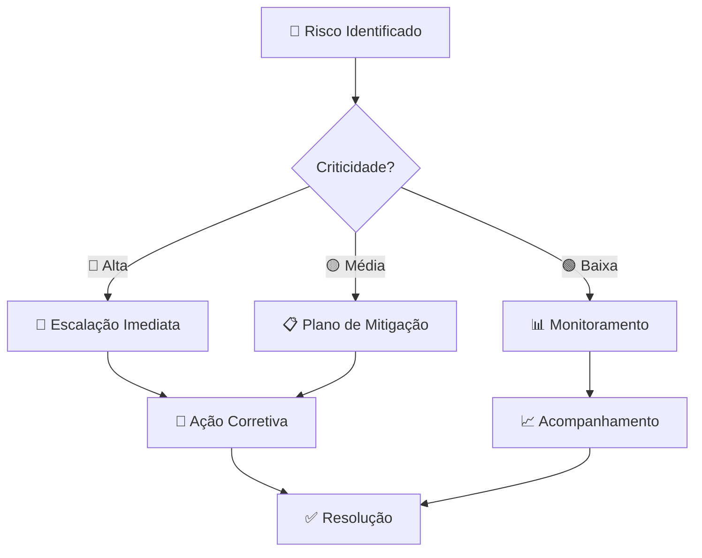

# 📅 Cronograma de Implementação

> **Fases, marcos e entregas do Gerador Automático de Emails**

📋 **Navegação**: [← Campanhas SAC](campanhas-sac.md) | [Próximo: Próximos Passos →](proximos-passos.md)

---

## 🎯 Visão Geral

O projeto será desenvolvido em 3 fases principais ao longo de 5 semanas, com entregas incrementais e validação contínua.

---

## 📊 Cronograma Gantt

---

## 🏗️ Fase 1: Base (2 semanas)

### 🎯 Objetivo
Estabelecer a infraestrutura básica e funcionalidades core do sistema.

### 📋 Entregas

| Entrega | Descrição | Responsável | Prazo |
|---------|-----------|-------------|-------|
| **🔧 Baserow Setup** | Configuração completa dos formulários | Backend | 3 dias |
| **⚙️ N8N Workflows** | Workflows básicos para cada tipo de campanha | Backend | 4 dias |
| **🎨 Templates HTML** | Templates funcionais baseados nos existentes | Frontend | 5 dias |
| **📧 SMTP Config** | Configuração de envio de emails | DevOps | 2 dias |

### ✅ Critérios de Aceitação

- [ ] ✅ Baserow aceita formulários de todas as campanhas
- [ ] ⚙️ N8N processa solicitações automaticamente
- [ ] 🎨 Templates geram HTML válido
- [ ] 📧 Emails são enviados com sucesso
- [ ] 📊 Logs básicos funcionam

### 🧪 Testes da Fase 1

---

## ⚡ Fase 2: Otimização (2 semanas)

### 🎯 Objetivo
Implementar personalização avançada, segmentação inteligente e analytics completos.

### 📋 Entregas

| Entrega | Descrição | Responsável | Prazo |
|---------|-----------|-------------|-------|
| **🤖 LLM Integration** | Geração de conteúdo personalizado | Backend | 3 dias |
| **🎯 Segmentação** | Sistema de segmentação automática | Backend | 4 dias |
| **📊 Analytics** | Tracking de abertura e clique | Full-stack | 3 dias |
| **🎨 Templates Avançados** | Templates específicos por campanha | Frontend | 5 dias |

### ✅ Critérios de Aceitação

- [ ] 🤖 LLM gera conteúdo personalizado
- [ ] 🎯 Segmentação automática funciona
- [ ] 📊 Métricas são coletadas corretamente
- [ ] 🎨 Todos os tipos de campanha têm templates
- [ ] 🖼️ Sistema de imagens funciona

### 📊 Métricas da Fase 2

| Métrica | Meta | Método de Medição |
|---------|------|-------------------|
| **Personalização** | 100% emails personalizados | Verificação automática |
| **Segmentação** | 95% precisão | Validação manual |
| **Performance** | < 2min por email | Logs de tempo |
| **Qualidade HTML** | 100% válido | Validador W3C |

---

## 🚀 Fase 3: Escalabilidade (1 semana)

### 🎯 Objetivo
Otimizar performance, implementar A/B testing e dashboard de monitoramento.

### 📋 Entregas

| Entrega | Descrição | Responsável | Prazo |
|---------|-----------|-------------|-------|
| **🧪 A/B Testing** | Sistema de testes A/B | Backend | 2 dias |
| **🔄 Otimizações** | Performance e escalabilidade | DevOps | 3 dias |
| **📈 Dashboard** | Interface de monitoramento | Frontend | 2 dias |

### ✅ Critérios de Aceitação

- [ ] 🧪 A/B testing funciona para campanhas
- [ ] 🚀 Sistema suporta 10k emails/hora
- [ ] 📈 Dashboard mostra métricas em tempo real
- [ ] 🔄 Sistema é resiliente a falhas
- [ ] 📋 Documentação completa

---

## 🎯 Marcos e Entregas

### 📊 Resumo Executivo

| Fase | Duração | Entregas Principais | Status |
|------|---------|-------------------|--------|
| **🏗️ Fase 1** | 2 semanas | • Baserow configurado • N8N workflows básicos • Templates funcionais | 🔄 Planejamento |
| **⚡ Fase 2** | 2 semanas | • Personalização completa • Analytics implementado • Todos os tipos de campanha | ⏳ Aguardando |
| **🚀 Fase 3** | 1 semana | • A/B testing • Dashboard completo • Sistema otimizado | ⏳ Aguardando |

### 🏆 Marcos Críticos

---

## 🔍 Critérios de Sucesso

### 📈 KPIs do Projeto

| KPI | Meta | Medição |
|-----|------|---------|
| **⏱️ Tempo de Criação** | -70% vs manual | Comparação temporal |
| **📧 Taxa de Abertura** | +30% vs atual | Analytics de email |
| **🎯 Taxa de Conversão** | +25% vs atual | Tracking de campanhas |
| **💰 Redução de Custos** | -50% vs atual | Análise financeira |
| **🚀 Performance** | 10k emails/hora | Teste de carga |

### ✅ Definição de Pronto

Uma funcionalidade está "pronta" quando:

1. ✅ **Desenvolvida** e testada
2. 📋 **Documentada** adequadamente
3. 🧪 **Testada** pela equipe
4. ✅ **Aprovada** pelo stakeholder
5. 🚢 **Deployada** em produção

---

## ⚠️ Riscos e Mitigações

### 🚨 Riscos Identificados

| Risco | Probabilidade | Impacto | Mitigação |
|-------|---------------|---------|-----------|
| **🔧 Complexidade N8N** | Média | Alto | Prototipagem prévia |
| **🤖 Limites da API LLM** | Baixa | Médio | Fallback manual |
| **📧 Deliverability** | Baixa | Alto | Testes com múltiplos provedores |
| **⏰ Atraso no cronograma** | Média | Médio | Buffer de tempo |

### 🛡️ Plano de Contingência

---

## 🔗 Navegação

- 🎧 **[← Campanhas SAC](campanhas-sac.md)**
- ✅ **[Próximo: Próximos Passos →](proximos-passos.md)**
- 📚 **[Voltar ao README](../README.md)**
- 🏗️ **[Ver Arquitetura →](arquitetura.md)**

---

  <strong>📅 Cronograma | Gerador de Emails Fornada de Vantagens</strong>

 