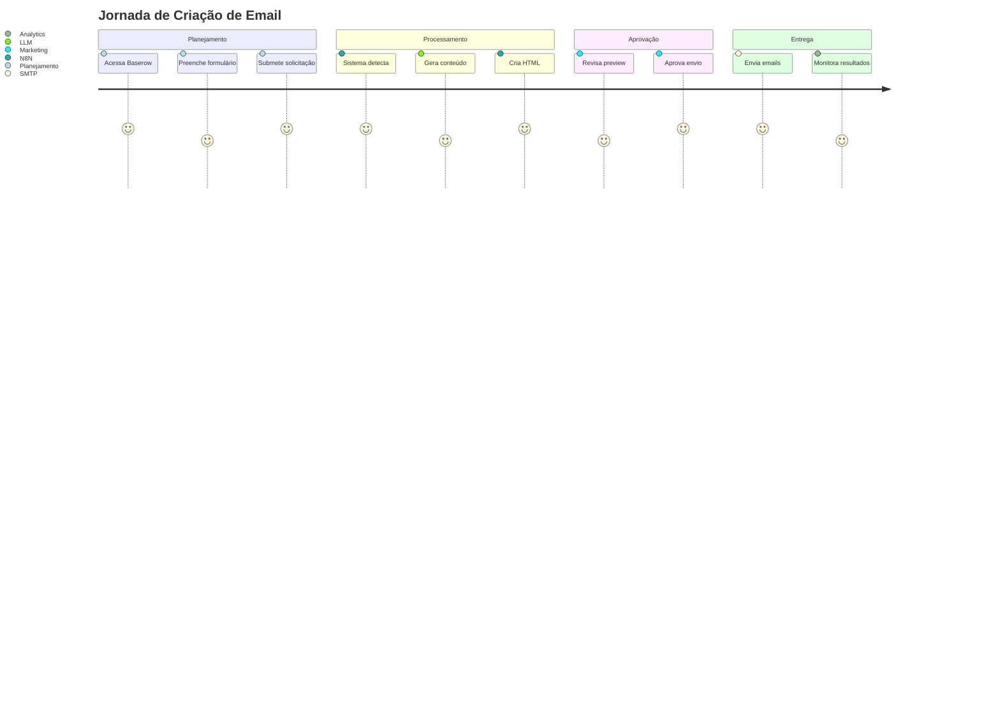

# 👥 Histórias de Usuário

> **Requisitos e experiência do usuário para o Gerador Automático de Emails**

📋 **Navegação**: [← Arquitetura](arquitetura.md) | [Próximo: Formulários Baserow →](baserow-forms.md)

---

## 🎯 Visão Geral

As histórias de usuário definem os requisitos funcionais do sistema sob a perspectiva de três perfis principais de usuários.

---

## 👤 Personas

### 🧑‍💼 Usuário do Planejamento
**Perfil**: Profissional de marketing/planejamento da Bunge  
**Objetivo**: Criar campanhas de email de forma autônoma  
**Nível técnico**: Básico

### 🎨 Usuário do Marketing
**Perfil**: Designer/Marketing que valida o conteúdo visual  
**Objetivo**: Garantir qualidade e consistência visual  
**Nível técnico**: Intermediário

### ⚙️ Usuário da Operação
**Perfil**: Técnico responsável pelo envio e monitoramento  
**Objetivo**: Automatizar e monitorar entregas  
**Nível técnico**: Avançado

---

## 📝 Histórias de Usuário

### 👤 Usuário do Planejamento

<strong>📧 História 1: Criar Campanha Promocional</strong>

> **Como** um profissional de planejamento da Bunge  
> **Quero** solicitar a criação de um email promocional  
> **Para que** possa automatizar campanhas sem depender de desenvolvimento técnico

#### ✅ Critérios de Aceitação
- [ ] Posso acessar um formulário simples no Baserow
- [ ] Posso selecionar o tipo de campanha (promocional, transacional, relacional, SAC)
- [ ] Posso inserir conteúdo específico, links e mensagens personalizadas
- [ ] Posso definir datas de envio e segmentação
- [ ] Recebo confirmação automática da solicitação

#### 🔧 Cenários de Teste
1. **Cenário Feliz**: Criar campanha "Indique um Amigo" com todos os campos preenchidos
2. **Cenário de Erro**: Tentar submeter sem campos obrigatórios
3. **Cenário Edge**: Criar campanha com data de envio no passado

<strong>📊 História 2: Acompanhar Status da Campanha</strong>

> **Como** um profissional de planejamento  
> **Quero** acompanhar o status da minha solicitação  
> **Para que** possa saber quando a campanha será enviada

#### ✅ Critérios de Aceitação
- [ ] Posso ver o status atual da campanha (Rascunho, Aprovado, Em Produção, Enviado)
- [ ] Recebo notificações sobre mudanças de status
- [ ] Posso ver métricas básicas após o envio
- [ ] Posso editar campanhas em status "Rascunho"

### 🎨 Usuário do Marketing

<strong>🖼️ História 3: Validar Conteúdo Visual</strong>

> **Como** um profissional de marketing  
> **Quero** que o sistema gere automaticamente o HTML do email  
> **Para que** não precise criar manualmente cada template

#### ✅ Critérios de Aceitação
- [ ] O sistema aplica automaticamente o template correto baseado no tipo de campanha
- [ ] O conteúdo personalizado é inserido no local correto
- [ ] O HTML gerado é compatível com clientes de email
- [ ] As imagens são referenciadas corretamente
- [ ] O sistema indica as especificações de imagens necessárias

#### 🎨 Especificações Visuais
- **Largura**: 600px máximo
- **Fontes**: Arial, Helvetica, sans-serif
- **Cores**: Paleta da marca Bunge
- **Responsividade**: Table-based para compatibilidade

<strong>📸 História 4: Gerenciar Imagens</strong>

> **Como** um profissional de marketing  
> **Quero** receber especificações claras das imagens necessárias  
> **Para que** possa criar os assets corretos

#### ✅ Critérios de Aceitação
- [ ] Recebo notificação com especificações de imagens (dimensões, formato, peso)
- [ ] Posso fazer upload das imagens na pasta correta
- [ ] O sistema valida automaticamente as imagens
- [ ] Recebo feedback sobre imagens com problemas

### ⚙️ Usuário da Operação

<strong>🚀 História 5: Automatizar Envios</strong>

> **Como** um profissional da operação  
> **Quero** que o sistema envie emails automaticamente  
> **Para que** não precise fazer envios manuais

#### ✅ Critérios de Aceitação
- [ ] O sistema envia emails na data e hora programadas
- [ ] A segmentação é aplicada corretamente
- [ ] O tracking de abertura e clique funciona
- [ ] Relatórios de performance são gerados automaticamente
- [ ] Falhas de envio são reportadas

#### 🔧 Especificações Técnicas
- **SMTP**: Configuração automática
- **Rate Limiting**: Respeitar limites do provedor
- **Retry**: Tentativas automáticas em caso de falha
- **Logs**: Registro completo de todas as operações

<strong>📊 História 6: Monitorar Performance</strong>

> **Como** um profissional da operação  
> **Quero** acompanhar métricas de performance  
> **Para que** possa otimizar futuras campanhas

#### ✅ Critérios de Aceitação
- [ ] Posso ver taxa de abertura em tempo real
- [ ] Posso ver taxa de clique por link
- [ ] Posso identificar emails com bounce
- [ ] Posso exportar relatórios em CSV/PDF
- [ ] Posso comparar performance entre campanhas

---

## 🗺️ Jornada do Usuário

### Fluxo Completo de Criação

---

## 🎯 Critérios de Aceitação Globais

### Funcionalidades Essenciais
- ✅ **Usabilidade**: Interface intuitiva para usuários não-técnicos
- ✅ **Automação**: Mínima intervenção manual após configuração
- ✅ **Personalização**: Conteúdo dinâmico baseado em dados do usuário
- ✅ **Compatibilidade**: HTML funcional em principais clientes de email
- ✅ **Performance**: Envio de até 10.000 emails por hora
- ✅ **Tracking**: Métricas completas de abertura e clique

### Requisitos Não-Funcionais
- 🔒 **Segurança**: Dados criptografados em trânsito e repouso
- 📊 **Observabilidade**: Logs detalhados de todas as operações
- 🔄 **Confiabilidade**: 99.9% de uptime
- 📈 **Escalabilidade**: Suporte a crescimento de 10x no volume

---

## 🔗 Navegação

- 🏗️ **[← Arquitetura](arquitetura.md)**
- 📋 **[Próximo: Formulários Baserow →](baserow-forms.md)**
- 🎁 **[Ver Campanhas Promocionais →](campanhas-promocionais.md)**
- 📊 **[Ver Cronograma →](cronograma.md)**

---

  <strong>👥 Histórias de Usuário | Gerador de Emails Fornada de Vantagens</strong>

 