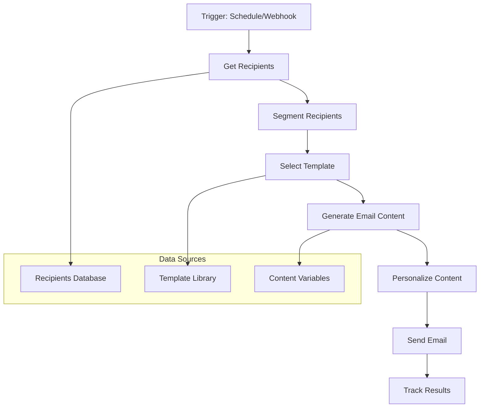

# Gerador Automático de Emails - N8N Workflow

## Visão Geral do Sistema

### Objetivo
Criar um workflow N8N que gere automaticamente emails personalizados da Bunge Profissional baseado em templates existentes, com personalização dinâmica de conteúdo e segmentação de audiência.

### Arquitetura do Workflow



## Estrutura do Workflow N8N

### 1. **Trigger Node**
```json
{
  "name": "trigger_email_campaign",
  "type": "schedule",
  "config": {
    "cron": "0 9 * * 1", // Segunda-feira às 9h
    "timezone": "America/Sao_Paulo"
  }
}
```

### 2. **Get Recipients Node**
```json
{
  "name": "get_email_recipients",
  "type": "supabase",
  "config": {
    "operation": "select",
    "table": "recipients",
    "filters": {
      "status": "active",
      "email_opt_in": true,
      "last_email_sent": "< 7 days ago"
    }
  }
}
```

### 3. **Segment Recipients Node**
```json
{
  "name": "segment_recipients",
  "type": "code",
  "config": {
    "jsCode": `
      const segments = {
        new_users: items.filter(item => item.days_since_signup <= 30),
        active_users: items.filter(item => item.points > 0 && item.last_activity <= 7),
        inactive_users: items.filter(item => item.last_activity > 30),
        expiring_points: items.filter(item => item.points_expiry_date <= 7)
      };
      return segments;
    `
  }
}
```

### 4. **Template Selector Node**
```json
{
  "name": "select_email_template",
  "type": "code",
  "config": {
    "jsCode": `
      const templateMap = {
        new_users: "1407_geracao_de_cadastros",
        active_users: "1407_raspadinha", 
        inactive_users: "1507_resgate_seus_pontos",
        expiring_points: "1507_resgate_seus_pontos"
      };
      
      return items.map(item => ({
        ...item,
        template: templateMap[item.segment]
      }));
    `
  }
}
```

### 5. **Content Generator Node**
```json
{
  "name": "generate_email_content",
  "type": "code",
  "config": {
    "jsCode": `
      const templates = {
        "1407_geracao_de_cadastros": {
          subject: "Cadastre-se no Fornada de Vantagens e ganhe pontos em dobro!",
          header_image: "header.png",
          content_image: "content.png",
          cta_image: "button-cta.png",
          message: "Ainda não faz parte do Fornada de Vantagens? Ao se cadastrar e realizar uma compra, você começa com pontos em dobro!"
        },
        "1407_raspadinha": {
          subject: "Dia da Pizza: Fornada de Vantagens tem surpresa para você!",
          header_image: "banner-principal.png", 
          content_image: "text.png",
          message: "No Dia da Pizza, celebramos uma das paixões nacionais do jeito que ela merece: com tradição, técnica e os ingredientes certos."
        },
        "1507_resgate_seus_pontos": {
          subject: "Seus pontos expiram em breve! Resgate agora!",
          header_image: "banner-principal.png",
          content_image: "premios.png",
          cta_image: "cta.png",
          urgency_image: "atencao.png",
          message: "No Fornada, você pode transformar seus pontos em prêmios de verdade para você ou para o seu negócio."
        }
      };
      
      return items.map(item => ({
        ...item,
        email_content: templates[item.template]
      }));
    `
  }
}
```

### 6. **Personalization Node**
```json
{
  "name": "personalize_email_content",
  "type": "code", 
  "config": {
    "jsCode": `
      return items.map(item => {
        const template = item.email_content;
        const recipient = item.recipient;
        
        // Personalizar mensagem
        let personalizedMessage = template.message;
        if (recipient.name) {
          personalizedMessage = `Olá ${recipient.name}, ${personalizedMessage}`;
        }
        
        // Adicionar pontos se aplicável
        if (recipient.points > 0) {
          personalizedMessage += ` Você tem ${recipient.points} pontos disponíveis.`;
        }
        
        // Adicionar urgência se pontos expiram
        if (recipient.points_expiry_date) {
          const daysToExpiry = Math.ceil((new Date(recipient.points_expiry_date) - new Date()) / (1000 * 60 * 60 * 24));
          if (daysToExpiry <= 7) {
            personalizedMessage += ` Seus pontos expiram em ${daysToExpiry} dias!`;
          }
        }
        
        return {
          ...item,
          personalized_content: {
            ...template,
            message: personalizedMessage,
            subject: template.subject.replace('{name}', recipient.name || '')
          }
        };
      });
    `
  }
}
```

### 7. **HTML Generator Node**
```json
{
  "name": "generate_html_email",
  "type": "code",
  "config": {
    "jsCode": `
      const baseUrl = "https://www.plataformaomnion.com.br/emails/fornada";
      
      function generateEmailHTML(template, content, recipient) {
        const html = \`
          <!DOCTYPE html>
          <html xmlns="http://www.w3.org/1999/xhtml" lang="pt-BR">
          <head>
            <meta charset="UTF-8">
            <meta http-equiv="Content-Type" content="text/html; charset=utf-8">
            <title>\${content.subject}</title>
          </head>
          <body>
            <!-- Header -->
            <table border="0" cellpadding="0" cellspacing="0" width="600" style="background:#ffffff; width: 600px; font-family: Arial, Helvetica, sans-serif;" align="center">
              <tr>
                <td align="left">
                  <a href="https://www.fornadadevantagens.com.br/" target="_blank">
                    
                  </a>
                </td>
              </tr>
            </table>
            
            <!-- Content -->
            <table border="0" cellpadding="0" cellspacing="0" width="600" style="background:#003458; width: 600px; font-family: Arial, Helvetica, sans-serif;" align="center">
              <tr>
                <td>
                  <font style="font-family: Arial, Helvetica, sans-serif; color: #ffffff; font-size: 15px;">
                    \${content.message}
                  </font>
                </td>
              </tr>
            </table>
            
            <!-- CTA Image -->
            \${content.content_image ? \`
            <table border="0" cellpadding="0" cellspacing="0" width="600" style="background:#ffffff; width: 600px; font-family: Arial, Helvetica, sans-serif;" align="center">
              <tr>
                <td>
                  <a href="https://www.fornadadevantagens.com.br/" target="_blank">
                    
                  </a>
                </td>
              </tr>
            </table>
            \` : ''}
            
            <!-- Footer -->
            \${generateFooter()}
          </body>
          </html>
        \`;
        
        return html;
      }
      
      function generateFooter() {
        return \`
          <table border="0" cellpadding="0" cellspacing="0" width="600" style="background:#043c5a; width: 600px; font-family: Arial, Helvetica, sans-serif;" align="center">
            <tr>
              <td>
                <font style="font-family: 'Lato', Arial, Helvetica, sans-serif; font-size: 12px; color: #ffffff;">
                  <b>Fale Conosco e WhatsApp</b>
                  <a href="https://wa.me/551108001128643" style="color: #ffffff; text-decoration: none">
                    <b>0800 11 28643</b></a>
                  <br/>
                  De segunda a sexta, das 8h às 18h<br />
                  <a href="mailto:contato@fornadadevantagens.com.br" style="color: #ffffff; text-decoration: none">
                    contato@fornadadevantagens.com.br
                  </a>
                </font>
              </td>
            </tr>
          </table>
        \`;
      }
      
      return items.map(item => ({
        ...item,
        html_content: generateEmailHTML(item.template, item.personalized_content, item.recipient)
      }));
    `
  }
}
```

### 8. **Email Sender Node**
```json
{
  "name": "send_email",
  "type": "email_sender",
  "config": {
    "service": "smtp",
    "smtp": {
      "host": "smtp.gmail.com",
      "port": 587,
      "secure": false,
      "auth": {
        "user": "{{ $env.EMAIL_USER }}",
        "pass": "{{ $env.EMAIL_PASS }}"
      }
    },
    "from": "Fornada de Vantagens <noreply@fornadadevantagens.com.br>",
    "to": "{{ $json.recipient.email }}",
    "subject": "{{ $json.personalized_content.subject }}",
    "html": "{{ $json.html_content }}"
  }
}
```

### 9. **Tracking Node**
```json
{
  "name": "track_email_sent",
  "type": "supabase",
  "config": {
    "operation": "upsert",
    "table": "email_campaigns",
    "data": {
      "recipient_id": "{{ $json.recipient.id }}",
      "template": "{{ $json.template }}",
      "subject": "{{ $json.personalized_content.subject }}",
      "sent_at": "{{ $now }}",
      "status": "sent"
    }
  }
}
```

## Estrutura de Dados

### Tabela: recipients
```sql
CREATE TABLE recipients (
  id SERIAL PRIMARY KEY,
  name VARCHAR(255),
  email VARCHAR(255) UNIQUE NOT NULL,
  points INTEGER DEFAULT 0,
  points_expiry_date DATE,
  days_since_signup INTEGER,
  last_activity DATE,
  segment VARCHAR(50),
  email_opt_in BOOLEAN DEFAULT true,
  last_email_sent TIMESTAMP,
  created_at TIMESTAMP DEFAULT NOW()
);
```

### Tabela: email_campaigns
```sql
CREATE TABLE email_campaigns (
  id SERIAL PRIMARY KEY,
  recipient_id INTEGER REFERENCES recipients(id),
  template VARCHAR(100),
  subject VARCHAR(255),
  sent_at TIMESTAMP,
  opened_at TIMESTAMP,
  clicked_at TIMESTAMP,
  status VARCHAR(50),
  created_at TIMESTAMP DEFAULT NOW()
);
```

### Tabela: email_templates
```sql
CREATE TABLE email_templates (
  id SERIAL PRIMARY KEY,
  template_code VARCHAR(100) UNIQUE,
  name VARCHAR(255),
  description TEXT,
  subject_template VARCHAR(255),
  message_template TEXT,
  header_image VARCHAR(255),
  content_image VARCHAR(255),
  cta_image VARCHAR(255),
  urgency_image VARCHAR(255),
  is_active BOOLEAN DEFAULT true,
  created_at TIMESTAMP DEFAULT NOW()
);
```

## Configurações de Ambiente

### Variáveis de Ambiente (.env)
```bash
# Email SMTP
EMAIL_USER=noreply@fornadadevantagens.com.br
EMAIL_PASS=your_smtp_password

# Supabase
SUPABASE_URL=your_supabase_url
SUPABASE_KEY=your_supabase_key

# Base URLs
EMAIL_BASE_URL=https://www.plataformaomnion.com.br/emails/fornada
FORNADA_URL=https://www.fornadadevantagens.com.br
LOJA_URL=https://loja.bungeprofissional.com.br
```

## Funcionalidades Avançadas

### 1. **A/B Testing**
- Múltiplas versões de assunto
- Diferentes CTAs
- Segmentação por performance

### 2. **Personalização Dinâmica**
- Nome do destinatário
- Pontos atuais
- Prêmios disponíveis
- Histórico de compras

### 3. **Segmentação Inteligente**
- Comportamento de abertura
- Histórico de cliques
- Frequência de compras
- Tempo desde último contato

### 4. **Automação de Campanhas**
- Sequências de onboarding
- Campanhas de reativação
- Promoções sazonais
- Follow-ups automáticos

## Monitoramento e Analytics

### Métricas Principais
- Taxa de abertura
- Taxa de clique
- Conversões
- Unsubscribes
- Bounce rate

### Dashboard de Performance
- Performance por template
- Segmentação por segmento
- ROI por campanha
- Tendências temporais

## Próximos Passos

1. **Implementação Base**
   - Configurar Supabase
   - Criar workflow N8N
   - Testar com dados reais

2. **Otimização**
   - A/B testing
   - Personalização avançada
   - Segmentação inteligente

3. **Escalabilidade**
   - Automação completa
   - Integração com CRM
   - Analytics avançados 