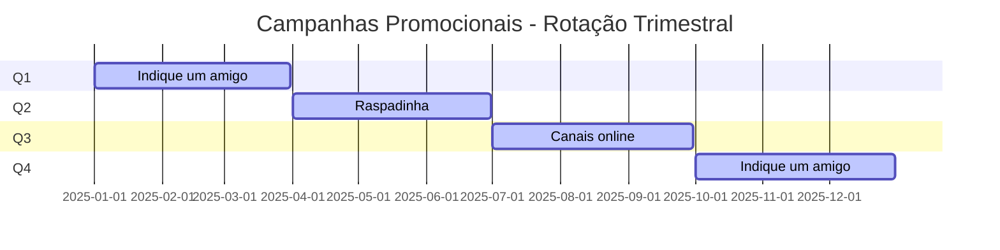
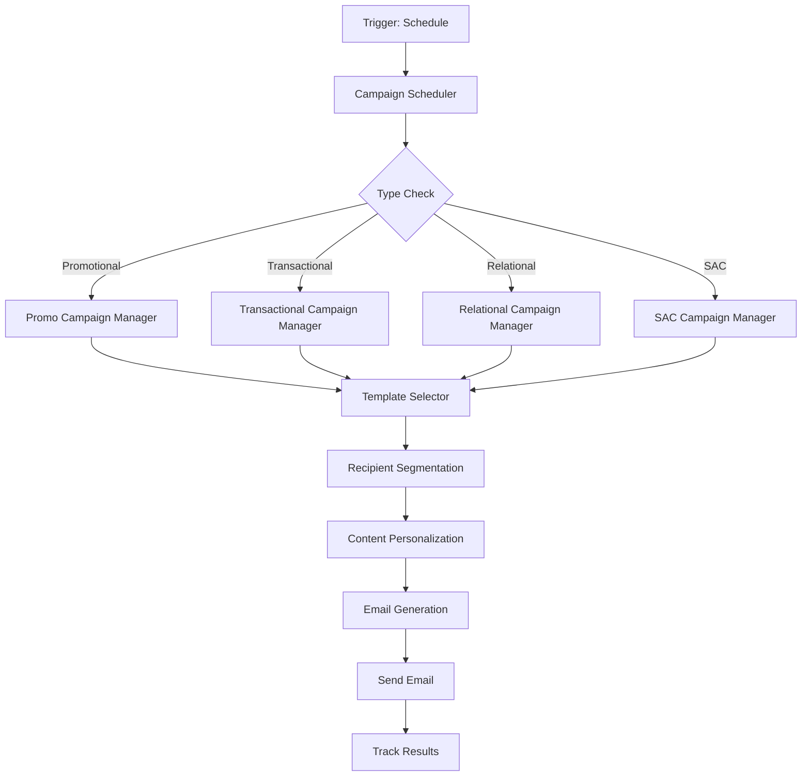

# Projeto Completo - Sistema de Emails Fornada de Vantagens

## Visão Geral do Programa

### Contexto
- **Programa**: Fornada de Vantagens (Bunge Profissional)
- **Objetivo**: Sistema de fidelidade com pontos e prêmios
- **Público**: Profissionais do setor alimentício (panificadores, pizzaiolos, etc.)
- **Estratégia**: Email marketing segmentado por tipo de campanha

## Estrutura de Campanhas por Tipo

### 1. **CAMPANHAS PROMOCIONAIS** (Rotação a cada 3 meses)


#### 1.1 **Indique um Amigo** (Q1, Q4)
- **Frequência**: 1x por trimestre
- **Objetivo**: Aquisição de novos usuários
- **Template**: Baseado em `1407_geracao_de_cadastros`
- **Segmento**: Usuários ativos com histórico de compras
- **Incentivo**: Pontos extras por indicação convertida

#### 1.2 **Raspadinha** (Q2)
- **Frequência**: 1x por trimestre  
- **Objetivo**: Engajamento e nutrição de base
- **Template**: Baseado em `1407_raspadinha`
- **Segmento**: Todos os usuários ativos
- **Incentivo**: Prêmios instantâneos via raspadinha digital

#### 1.3 **Canais Online** (Q3)
- **Frequência**: 1x por trimestre
- **Objetivo**: Migração para canais digitais
- **Template**: Novo template específico
- **Segmento**: Usuários que ainda usam canais tradicionais
- **Incentivo**: Pontos extras por uso de canais online

### 2. **CAMPANHAS TRANSACIONAIS** (Contínuas)
#### 2.1 **Resgate de Pontos**
- **Frequência**: Semanal/Mensal
- **Objetivo**: Conversão de pontos em prêmios
- **Template**: Baseado em `1507_resgate_seus_pontos`
- **Segmento**: Usuários com pontos próximos do vencimento
- **Trigger**: 7, 3 e 1 dia antes do vencimento

### 3. **CAMPANHAS RELACIONAIS** (Sazonais)
#### 3.1 **Datas Comemorativas**
- **Frequência**: 1-2x por mês
- **Objetivo**: Relacionamento e engajamento
- **Templates**: Específicos por data
- **Segmento**: Todos os usuários
- **Datas**: Dia do Padeiro, Dia da Pizza, Natal, etc.

#### 3.2 **Lançamento de Cursos Online**
- **Frequência**: 1-2x por mês
- **Objetivo**: Educação e valor agregado
- **Template**: Novo template educacional
- **Segmento**: Usuários interessados em capacitação

#### 3.3 **Convite Eventos**
- **Frequência**: 1-2x por mês
- **Objetivo**: Participação em eventos Bunge
- **Template**: Novo template de eventos
- **Segmento**: Usuários por região/segmento

### 4. **CAMPANHAS SAC/SABE** (Suporte)
#### 4.1 **Datas Comemorativas SAC**
- **Frequência**: 1-2x por mês
- **Objetivo**: Relacionamento via SAC
- **Template**: Versão simplificada para SAC
- **Segmento**: Usuários com histórico de contato SAC

## Arquitetura do Sistema N8N

### Workflow Principal: Gerenciador de Campanhas


### Workflows Específicos

#### 1. **Workflow: Campanhas Promocionais**
```json
{
  "name": "promotional_campaign_workflow",
  "nodes": [
    {
      "name": "check_campaign_rotation",
      "type": "code",
      "config": {
        "jsCode": `
          const currentQuarter = Math.ceil(new Date().getMonth() / 3);
          const campaignMap = {
            1: "indique_amigo",
            2: "raspadinha", 
            3: "canais_online",
            4: "indique_amigo"
          };
          return { campaign: campaignMap[currentQuarter] };
        `
      }
    },
    {
      "name": "get_promotional_recipients",
      "type": "supabase",
      "config": {
        "operation": "select",
        "table": "recipients",
        "filters": {
          "status": "active",
          "last_purchase_date": ">= 30 days ago",
          "email_opt_in": true
        }
      }
    }
  ]
}
```

#### 2. **Workflow: Campanhas Transacionais**
```json
{
  "name": "transactional_campaign_workflow", 
  "nodes": [
    {
      "name": "check_expiring_points",
      "type": "supabase",
      "config": {
        "operation": "select",
        "table": "recipients",
        "filters": {
          "points_expiry_date": "<= 7 days",
          "points": "> 0"
        }
      }
    },
    {
      "name": "segment_by_expiry",
      "type": "code",
      "config": {
        "jsCode": `
          return items.map(item => {
            const daysToExpiry = Math.ceil((new Date(item.points_expiry_date) - new Date()) / (1000 * 60 * 60 * 24));
            return {
              ...item,
              urgency_level: daysToExpiry <= 1 ? "critical" : daysToExpiry <= 3 ? "high" : "medium"
            };
          });
        `
      }
    }
  ]
}
```

#### 3. **Workflow: Campanhas Relacionais**
```json
{
  "name": "relational_campaign_workflow",
  "nodes": [
    {
      "name": "check_commemorative_dates",
      "type": "code", 
      "config": {
        "jsCode": `
          const commemorativeDates = {
            "2025-01-15": "Dia do Padeiro",
            "2025-02-10": "Dia da Pizza",
            "2025-03-21": "Dia da Panificação",
            "2025-12-25": "Natal"
          };
          
          const today = new Date().toISOString().split('T')[0];
          return commemorativeDates[today] ? { event: commemorativeDates[today] } : null;
        `
      }
    }
  ]
}
```

## Estrutura de Dados Expandida

### Tabela: campaigns
```sql
CREATE TABLE campaigns (
  id SERIAL PRIMARY KEY,
  campaign_code VARCHAR(100) UNIQUE,
  name VARCHAR(255),
  type VARCHAR(50), -- promotional, transactional, relational, sac
  frequency VARCHAR(50), -- daily, weekly, monthly, quarterly
  rotation_quarter INTEGER, -- 1-4 para campanhas promocionais
  template_id INTEGER REFERENCES email_templates(id),
  is_active BOOLEAN DEFAULT true,
  start_date DATE,
  end_date DATE,
  created_at TIMESTAMP DEFAULT NOW()
);
```

### Tabela: campaign_schedule
```sql
CREATE TABLE campaign_schedule (
  id SERIAL PRIMARY KEY,
  campaign_id INTEGER REFERENCES campaigns(id),
  scheduled_date DATE,
  status VARCHAR(50), -- scheduled, sent, cancelled
  recipients_count INTEGER,
  sent_count INTEGER,
  opened_count INTEGER,
  clicked_count INTEGER,
  created_at TIMESTAMP DEFAULT NOW()
);
```

### Tabela: recipients (Expandida)
```sql
ALTER TABLE recipients ADD COLUMN (
  campaign_preferences JSONB,
  last_purchase_date DATE,
  total_purchases INTEGER DEFAULT 0,
  total_points_earned INTEGER DEFAULT 0,
  total_points_redeemed INTEGER DEFAULT 0,
  preferred_channel VARCHAR(50),
  sac_contact_history BOOLEAN DEFAULT false,
  event_participation_history JSONB
);
```

## Templates de Email por Tipo

### 1. **Template Promocional - Indique um Amigo**
```html
<!-- Baseado em 1407_geracao_de_cadastros -->
<!-- Modificações: -->
- CTA: "Indique um amigo e ganhe 500 pontos"
- Mensagem: "Seu amigo também ganha 200 pontos de boas-vindas"
- Link: URL de indicação personalizada
```

### 2. **Template Promocional - Raspadinha**
```html
<!-- Baseado em 1407_raspadinha -->
<!-- Modificações: -->
- CTA: "Raspe e ganhe prêmios instantâneos"
- Integração: Link para raspadinha digital
- Tracking: Código único por usuário
```

### 3. **Template Transacional - Resgate**
```html
<!-- Baseado em 1507_resgate_seus_pontos -->
<!-- Modificações: -->
- Personalização: "Você tem {pontos} pontos"
- Urgência: "Expira em {dias} dias"
- CTA: "Resgatar agora"
```

### 4. **Template Relacional - Datas Comemorativas**
```html
<!-- Novo template -->
<!-- Elementos: -->
- Header: Data específica
- Conteúdo: Mensagem de parabéns + oferta especial
- CTA: "Aproveite a oferta especial"
```

## Configuração de Automação

### Cronograma de Execução
```bash
# Campanhas Promocionais (Trimestral)
0 9 1 1,4,7,10 * # Indique um amigo (Q1, Q4)
0 9 1 4 * # Raspadinha (Q2)  
0 9 1 7 * # Canais online (Q3)

# Campanhas Transacionais (Diário)
0 10 * * * # Verificar pontos expirando

# Campanhas Relacionais (Mensal)
0 9 15 * * # Datas comemorativas
0 9 1 * * # Cursos e eventos

# Campanhas SAC (Mensal)
0 9 5 * * # SAC datas comemorativas
```

### Variáveis de Ambiente
```bash
# Campanhas
CAMPAIGN_ROTATION_ENABLED=true
PROMOTIONAL_CAMPAIGN_INTERVAL=90 # dias
TRANSACTIONAL_CHECK_INTERVAL=1 # dias
RELATIONAL_CAMPAIGN_INTERVAL=30 # dias

# Templates
TEMPLATE_BASE_URL=https://www.plataformaomnion.com.br/emails/fornada
CAMPAIGN_TEMPLATES_PATH=/templates/campaigns

# Tracking
TRACKING_ENABLED=true
ANALYTICS_ENABLED=true
```

## Monitoramento e Analytics

### Dashboard de Campanhas
- **Performance por Tipo**: Promocional vs Transacional vs Relacional
- **Rotação Trimestral**: Acompanhamento das campanhas promocionais
- **Conversões por Campanha**: Taxa de sucesso de cada tipo
- **Segmentação**: Performance por segmento de usuário

### Métricas Específicas
- **Promocionais**: Taxa de indicação, conversão de raspadinha
- **Transacionais**: Taxa de resgate, valor médio resgatado
- **Relacionais**: Engajamento em datas especiais, participação em eventos
- **SAC**: Satisfação do cliente, resolução de problemas

## Próximos Passos de Implementação

### Fase 1: Estrutura Base (2 semanas)
1. Configurar banco de dados com novas tabelas
2. Implementar workflow principal de campanhas
3. Criar templates base para cada tipo
4. Configurar segmentação básica

### Fase 2: Automação (2 semanas)
1. Implementar rotação automática de campanhas promocionais
2. Configurar triggers para campanhas transacionais
3. Criar sistema de datas comemorativas
4. Implementar tracking e analytics

### Fase 3: Otimização (1 semana)
1. A/B testing para campanhas promocionais
2. Personalização avançada por segmento
3. Integração com SAC/SABE
4. Dashboard de performance

### Fase 4: Escalabilidade (Contínuo)
1. Machine learning para segmentação
2. Otimização automática de horários
3. Integração com CRM completo
4. Analytics preditivos 