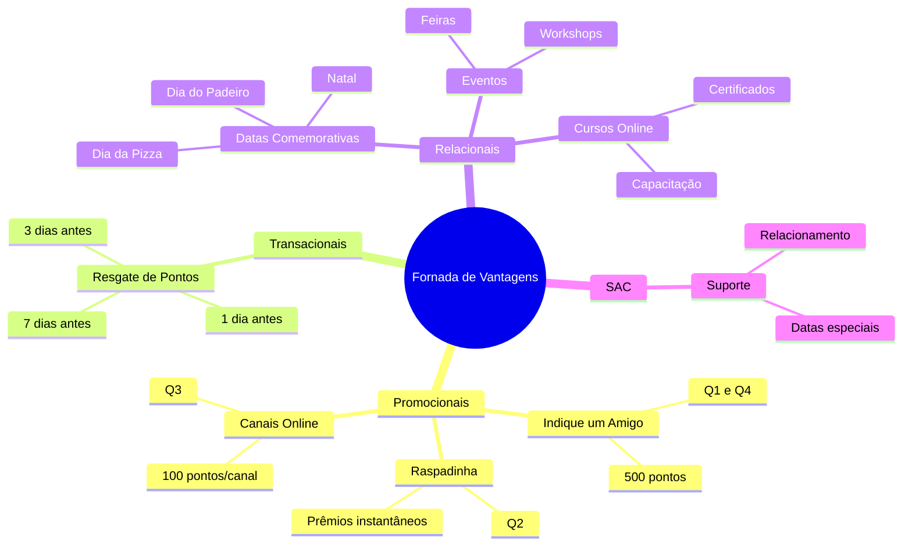
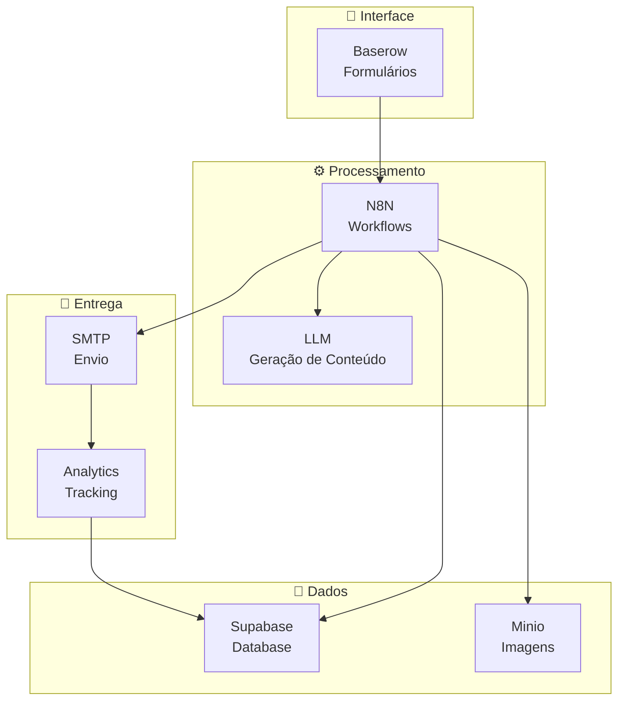
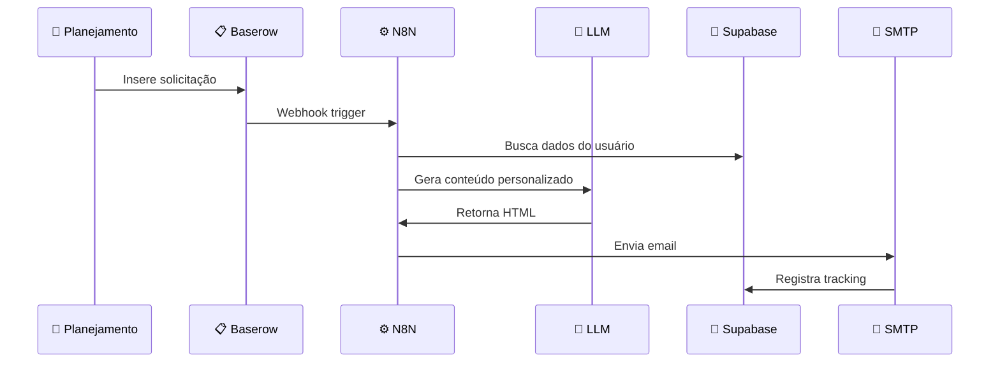
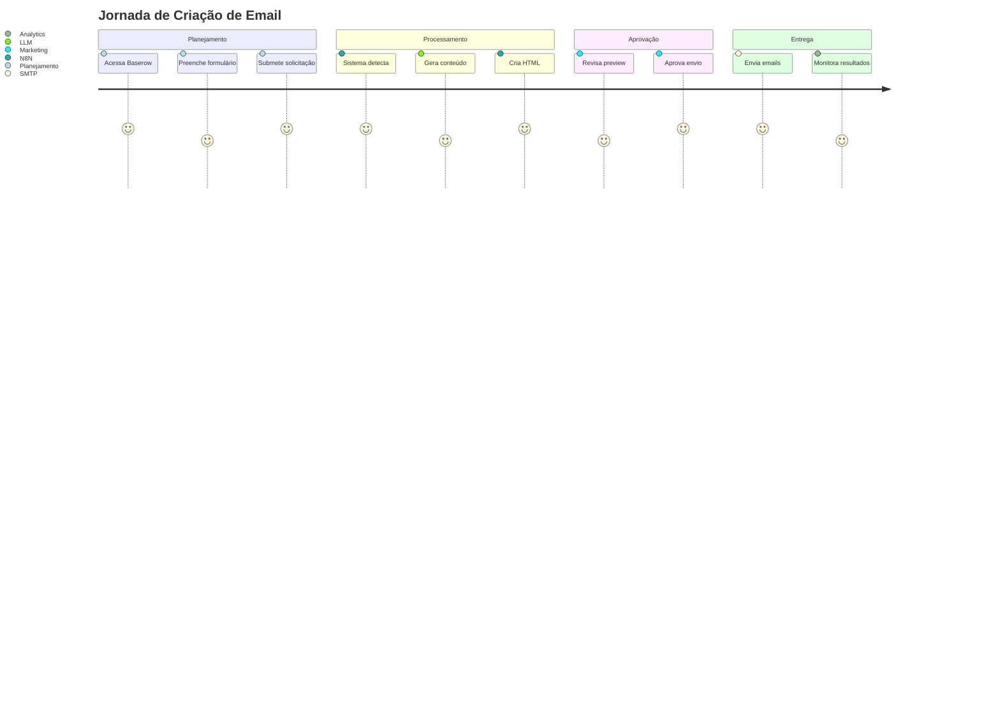
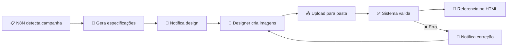
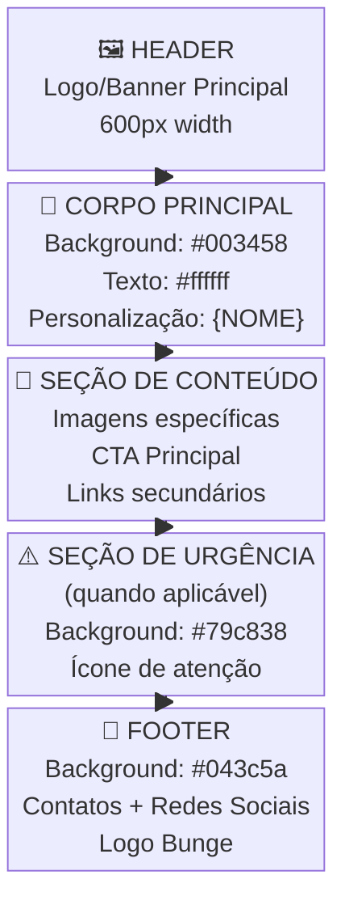
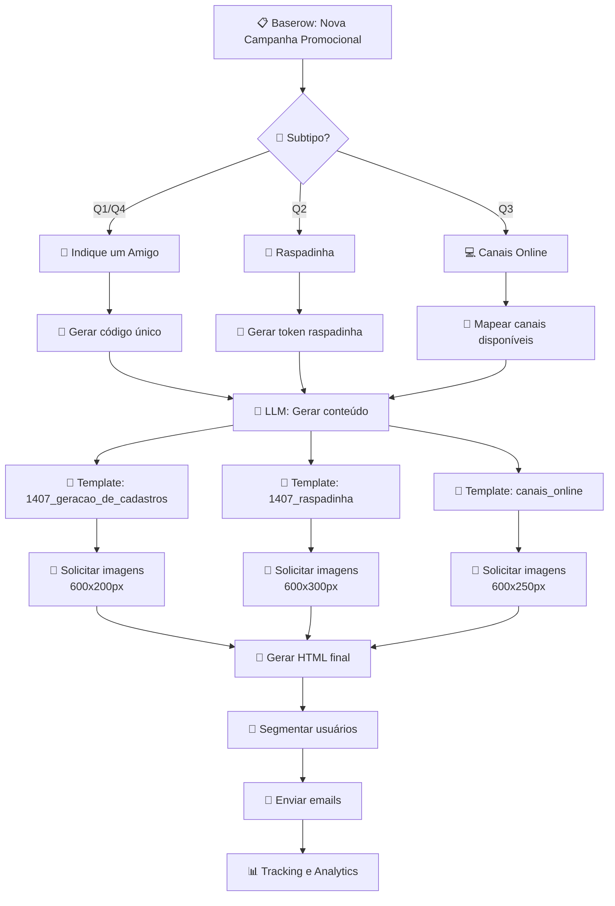
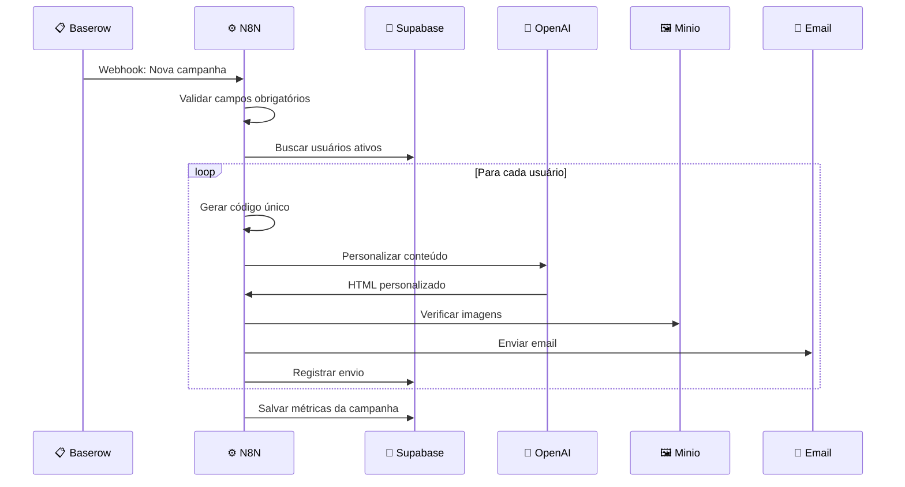
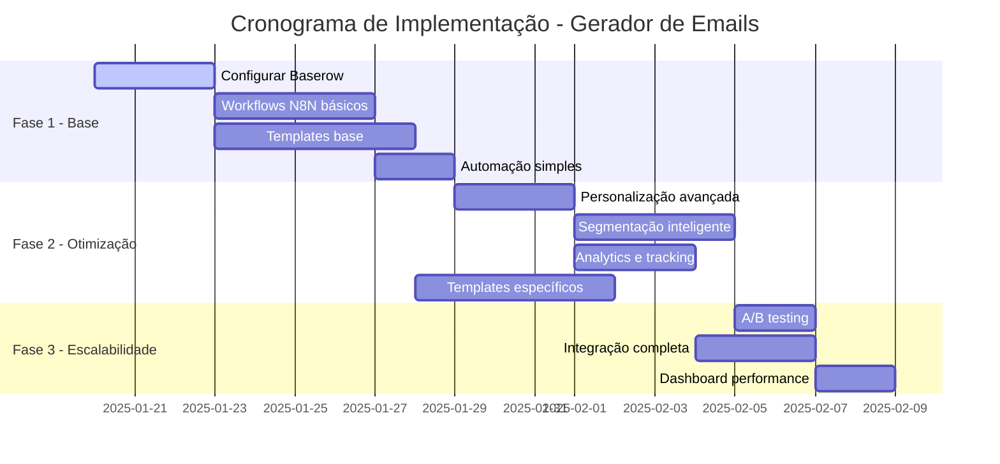

# 📧 Gerador Automático de Emails - Fornada de Vantagens

> **Sistema inteligente de geração e envio de emails personalizados para o programa de fidelidade da Bunge Profissional**

---

## 📋 Índice

### 🎯 [Visão Geral](#-visão-geral)
- [Proposta do Projeto](#proposta-do-projeto)
- [Objetivos Estratégicos](#objetivos-estratégicos)

### 🏗️ [Arquitetura](#️-arquitetura)
- [Estrutura de Campanhas](#estrutura-de-campanhas)
- [Componentes do Sistema](#componentes-do-sistema)
- [Fluxo de Dados](#fluxo-de-dados)

### 👥 [Experiência do Usuário](#-experiência-do-usuário)
- [Histórias de Usuário](#histórias-de-usuário)
- [Jornada do Usuário](#jornada-do-usuário)

### ⚙️ [Fluxos de Produção](#️-fluxos-de-produção)
- [Estrutura Base](#estrutura-base)
- [Campanhas Promocionais](#campanhas-promocionais)
- [Campanhas Transacionais](#campanhas-transacionais)
- [Campanhas Relacionais](#campanhas-relacionais)
- [Campanhas SAC](#campanhas-sac)

### 📅 [Implementação](#-implementação)
- [Cronograma](#cronograma-de-implementação)
- [Próximos Passos](#próximos-passos)

---

## 🎯 Visão Geral

### Proposta do Projeto

> 🚀 **Sistema automatizado de geração e envio de emails** para o programa de fidelidade "Fornada de Vantagens" da Bunge Profissional, com **segmentação inteligente** e **personalização dinâmica**.

### Objetivos Estratégicos

| Objetivo | Descrição | Impacto |
|----------|-----------|---------|
| 🤖 **Automatização** | Eliminar criação manual de campanhas | ⚡ 70% redução no tempo |
| 🎯 **Personalização** | Comunicação baseada em comportamento | 📈 30% aumento na abertura |
| 💰 **Conversão** | Maior engajamento do programa de pontos | 📊 25% aumento na conversão |
| 💡 **Eficiência** | Reduzir custos operacionais | 💸 50% redução nos custos |

---

## 🏗️ Arquitetura

### Estrutura de Campanhas



### Componentes do Sistema



### Fluxo de Dados



---

## 👥 Experiência do Usuário

### Histórias de Usuário

<details>
<summary><strong>👤 Usuário do Planejamento</strong></summary>

> **Como** um profissional de planejamento da Bunge  
> **Quero** solicitar a criação de um email promocional  
> **Para que** possa automatizar campanhas sem depender de desenvolvimento técnico

#### ✅ Critérios de Aceitação
- [ ] Posso acessar um formulário simples no Baserow
- [ ] Posso selecionar o tipo de campanha (promocional, transacional, relacional, SAC)
- [ ] Posso inserir conteúdo específico, links e mensagens personalizadas
- [ ] Posso definir datas de envio e segmentação
- [ ] Recebo confirmação automática da solicitação

</details>

<details>
<summary><strong>🎨 Usuário do Marketing</strong></summary>

> **Como** um profissional de marketing  
> **Quero** que o sistema gere automaticamente o HTML do email  
> **Para que** não precise criar manualmente cada template

#### ✅ Critérios de Aceitação
- [ ] O sistema aplica automaticamente o template correto baseado no tipo de campanha
- [ ] O conteúdo personalizado é inserido no local correto
- [ ] O HTML gerado é compatível com clientes de email
- [ ] As imagens são referenciadas corretamente
- [ ] O sistema indica as especificações de imagens necessárias

</details>

<details>
<summary><strong>⚙️ Usuário da Operação</strong></summary>

> **Como** um profissional da operação  
> **Quero** que o sistema envie emails automaticamente  
> **Para que** não precise fazer envios manuais

#### ✅ Critérios de Aceitação
- [ ] O sistema envia emails na data e hora programadas
- [ ] A segmentação é aplicada corretamente
- [ ] O tracking de abertura e clique funciona
- [ ] Relatórios de performance são gerados automaticamente
- [ ] Falhas de envio são reportadas

</details>

### Jornada do Usuário



---

## ⚙️ Fluxos de Produção

### Estrutura Base

#### 📋 Formulário Baserow - Campos Universais

| Campo | Tipo | Descrição | Obrigatório |
|-------|------|-----------|-------------|
| `id` | UUID | Identificador único da campanha | ✅ |
| `tipo` | Select | Promocional, Transacional, Relacional, SAC | ✅ |
| `subtipo` | Select | Específico do tipo selecionado | ✅ |
| `status` | Select | Rascunho → Aprovado → Em Produção → Enviado | ✅ |
| `criado_por` | User | Usuário que criou a solicitação | ✅ |
| `data_envio` | DateTime | Data/hora programada para envio | ✅ |
| `segmento` | Select | Público-alvo da campanha | ✅ |
| `assunto` | Text | Linha de assunto do email | ✅ |
| `mensagem_principal` | Long Text | Texto principal da campanha | ✅ |
| `cta_principal` | Text | Texto do botão principal | ✅ |
| `url_principal` | URL | Link do CTA principal | ✅ |
| `observacoes` | Long Text | Notas adicionais | ❌ |

#### 🎯 Campos Específicos por Tipo

<details>
<summary><strong>🎁 Promocional</strong></summary>

| Campo | Tipo | Descrição |
|-------|------|-----------|
| `incentivo` | Text | Descrição do incentivo oferecido |
| `pontos_oferecidos` | Number | Quantidade de pontos |
| `validade_promocao` | Date | Data de validade da promoção |
| `codigo_promocional` | Text | Código único (se aplicável) |

</details>

<details>
<summary><strong>💳 Transacional</strong></summary>

| Campo | Tipo | Descrição |
|-------|------|-----------|
| `dias_expiracao` | Select | 7, 3, 1 dias antes |
| `nivel_urgencia` | Select | Baixa, Média, Alta, Crítica |
| `pontos_minimos` | Number | Pontos mínimos para trigger |

</details>

<details>
<summary><strong>🎉 Relacional</strong></summary>

| Campo | Tipo | Descrição |
|-------|------|-----------|
| `data_comemorativa` | Text | Nome da data especial |
| `oferta_especial` | Text | Oferta relacionada à data |
| `tipo_evento` | Select | Curso, Evento, Feira |
| `localizacao` | Text | Local do evento (se aplicável) |

</details>

<details>
<summary><strong>🎧 SAC</strong></summary>

| Campo | Tipo | Descrição |
|-------|------|-----------|
| `canal_contato` | Multi-Select | WhatsApp, Telefone, Email |
| `horario_atendimento` | Text | Horário de funcionamento |
| `equipe_responsavel` | Text | Equipe ou pessoa responsável |

</details>

### 🖼️ Gestão de Imagens

#### 📁 Estrutura de Pastas

```
📂 /emails/fornada/
├── 📂 campanhas/
│   ├── 📂 promocionais/
│   │   ├── 📂 indique_amigo/
│   │   │   ├── 🖼️ banner_principal.png (600x200px)
│   │   │   └── 🖼️ cta_button.png (200x50px)
│   │   ├── 📂 raspadinha/
│   │   │   ├── 🖼️ banner_principal.png (600x300px)
│   │   │   └── 🖼️ elementos_jogo.png (600x250px)
│   │   └── 📂 canais_online/
│   │       ├── 🖼️ banner_canais.png (600x250px)
│   │       └── 🖼️ icons_canais.png (300x100px)
│   ├── 📂 transacionais/
│   │   └── 📂 resgate_pontos/
│   │       ├── 🖼️ banner_urgencia.png (600x200px)
│   │       └── 🖼️ icone_atencao.png (50x50px)
│   ├── 📂 relacionais/
│   │   ├── 📂 datas_comemorativas/
│   │   │   └── 🖼️ banner_[data].png (600x300px)
│   │   ├── 📂 cursos/
│   │   │   └── 🖼️ banner_educacional.png (600x250px)
│   │   └── 📂 eventos/
│   │       └── 🖼️ banner_evento.png (600x300px)
│   └── 📂 sac/
│       └── 🖼️ banner_suporte.png (600x200px)
└── 📂 assets/
    ├── 📂 logos/
    │   └── 🖼️ bunge_logo.png (166x50px)
    └── 📂 social/
        ├── 🖼️ facebook.png (30x30px)
        ├── 🖼️ instagram.png (30x30px)
        ├── 🖼️ youtube.png (30x30px)
        └── 🖼️ whatsapp.png (30x30px)
```

#### 📐 Especificações Técnicas

| Tipo de Imagem | Dimensões | Formato | Peso Máximo |
|----------------|-----------|---------|-------------|
| 🖼️ **Banner Principal** | 600x200px | PNG/JPG | 150KB |
| 🖼️ **Banner Secundário** | 600x300px | PNG/JPG | 200KB |
| 🖼️ **Banner Especial** | 600x250px | PNG/JPG | 180KB |
| 🔘 **CTA Button** | 200x50px | PNG | 20KB |
| 🏢 **Logo Bunge** | 166x50px | PNG | 15KB |
| 📱 **Ícones Sociais** | 30x30px | PNG | 5KB |

#### 🔄 Fluxo de Gestão de Imagens



### 🤖 Modelo LLM para Geração de Conteúdo

#### 📝 Prompt Base

<details>
<summary><strong>Visualizar Prompt Completo</strong></summary>

```markdown
# Sistema de Geração de Emails - Fornada de Vantagens

Você é um especialista em email marketing para o programa "Fornada de Vantagens" da Bunge Profissional.

## Contexto
- 🏢 **Empresa**: Bunge Profissional
- 🎯 **Programa**: Sistema de fidelidade com pontos e prêmios
- 👥 **Público**: Panificadores, pizzaiolos, profissionais do setor alimentício
- 🎨 **Tom**: Profissional, acolhedor, técnico quando necessário

## Dados da Campanha
- **Tipo**: {TIPO}
- **Subtipo**: {SUBTIPO}
- **Mensagem Principal**: {MENSAGEM}
- **CTA**: {CTA}
- **Segmento**: {SEGMENTO}

## Especificações Técnicas
1. ✅ **Estrutura**: Table-based para máxima compatibilidade
2. 📏 **Largura**: Máxima 600px
3. 🔤 **Fonte**: Arial, Helvetica, sans-serif
4. 🎨 **Cores da Marca**:
   - Azul Principal: #003458, #043c5a
   - Verde Urgência: #79c838
   - Laranja Destaque: #e08516
   - Branco: #ffffff
5. 🔗 **Personalização**: Incluir variáveis {NOME}, {PONTOS}, {DATA_EXPIRACAO}
6. 📧 **Footer**: Padrão com contatos e redes sociais
7. 📊 **Tracking**: Pixel de abertura e UTMs nos links

## Output
Retorne APENAS o HTML completo, sem explicações adicionais.
```

</details>

#### 🔧 Variáveis de Personalização

| Variável | Descrição | Exemplo |
|----------|-----------|---------|
| `{NOME}` | Nome do destinatário | "João Silva" |
| `{PONTOS}` | Pontos atuais disponíveis | "1.250" |
| `{DATA_EXPIRACAO}` | Data de expiração dos pontos | "15/03/2025" |
| `{DIAS_RESTANTES}` | Dias até expiração | "7" |
| `{SEGMENTO}` | Segmento do usuário | "usuario_ativo" |
| `{ULTIMA_ATIVIDADE}` | Última atividade registrada | "Compra em 10/01/2025" |
| `{HISTORICO_COMPRAS}` | Histórico de compras | "3 compras nos últimos 30 dias" |
| `{PREFERENCIAS}` | Preferências de comunicação | "emails_promocionais" |

### 📧 Estrutura Descritiva do Email

#### 🏗️ Anatomia do Email



#### 📋 Especificações por Seção

<table>
<tr>
<th>🏷️ Seção</th>
<th>🎨 Estilo</th>
<th>📐 Dimensões</th>
<th>📄 Conteúdo</th>
</tr>
<tr>
<td><strong>🖼️ Header</strong></td>
<td>
• Background: #ffffff<br/>
• Link: fornadadevantagens.com.br
</td>
<td>
• Largura: 600px<br/>
• Altura: variável
</td>
<td>
• Logo/Banner principal<br/>
• Alt text descritivo
</td>
</tr>
<tr>
<td><strong>📝 Corpo</strong></td>
<td>
• Background: #003458/#043c5a<br/>
• Texto: #ffffff<br/>
• Font: Arial 15px
</td>
<td>
• Largura: 600px<br/>
• Padding: 20px
</td>
<td>
• Saudação personalizada<br/>
• Mensagem principal<br/>
• Destaques em #e08516
</td>
</tr>
<tr>
<td><strong>🎨 Conteúdo</strong></td>
<td>
• Background: #ffffff<br/>
• Imagens: display block
</td>
<td>
• Largura: 600px<br/>
• Imagens: específicas
</td>
<td>
• Imagens de produtos/prêmios<br/>
• CTA principal<br/>
• Links secundários
</td>
</tr>
<tr>
<td><strong>⚠️ Urgência</strong></td>
<td>
• Background: #79c838<br/>
• Texto: #003558<br/>
• Font: Arial 20px bold
</td>
<td>
• Largura: 600px<br/>
• Altura: mínima
</td>
<td>
• Ícone de atenção<br/>
• Mensagem de urgência<br/>
• CTA urgente
</td>
</tr>
<tr>
<td><strong>🔗 Footer</strong></td>
<td>
• Background: #043c5a<br/>
• Texto: #ffffff<br/>
• Font: Arial 12px
</td>
<td>
• Largura: 600px<br/>
• 2 colunas
</td>
<td>
• Contatos (WhatsApp, email)<br/>
• Redes sociais<br/>
• Logo Bunge
</td>
</tr>
</table>

---

## Campanhas Promocionais

> 🎁 **Objetivo**: Aquisição, engajamento e migração de usuários através de incentivos e gamificação

### 🔄 Fluxo Geral - Campanhas Promocionais



### 🤝 1.1 Indique um Amigo (Q1, Q4)

#### 📋 Configuração no Baserow

| Campo | Valor | Observações |
|-------|-------|-------------|
| **Tipo** | `Promocional` | |
| **Subtipo** | `indique_amigo` | |
| **Assunto** | `"Indique um amigo e ganhe 500 pontos no Fornada de Vantagens!"` | |
| **Mensagem Principal** | `"Olá {NOME}, que tal ganhar 500 pontos indicando um amigo? Seu amigo também ganha 200 pontos de boas-vindas!"` | |
| **CTA Principal** | `"Indicar Amigo"` | |
| **URL Principal** | `"https://fornadadevantagens.com.br/indique?ref={CODIGO_UNICO}"` | Código único por usuário |
| **Incentivo** | `"500 pontos por indicação convertida"` | |
| **Pontos Oferecidos** | `500` | |
| **Validade** | `"30 dias"` | |
| **Segmento** | `"usuarios_ativos_com_historico"` | |

#### ⚙️ Fluxo N8N Específico



#### 🎨 Template Base: `1407_geracao_de_cadastros`

**Estrutura HTML:**
- 🖼️ **Header**: Banner principal com logo Bunge
- 📝 **Corpo**: Mensagem personalizada com nome do usuário
- 🎁 **Incentivo**: Destaque para os 500 pontos
- 🔗 **CTA**: Botão "Indicar Amigo" com link único
- 📧 **Footer**: Contatos e redes sociais padrão

**Imagens Necessárias:**
- `banner_indique_amigo.png` (600x200px)
- `cta_indicar.png` (200x50px)

#### 1.2 Raspadinha (Q2)
**Formulário Baserow:**
```
Tipo: Promocional
Subtipo: raspadinha
Assunto: "Raspe e ganhe prêmios instantâneos no Fornada!"
Mensagem Principal: "Olá {NOME}, que tal raspar e ganhar prêmios instantâneos? Temos eletrodomésticos, vouchers e muito mais!"
CTA Principal: "Raspar Agora"
URL Principal: "https://fornadadevantagens.com.br/raspadinha?token={TOKEN_UNICO}"
Segmento: "todos_usuarios_ativos"
```

**Processo N8N:**
1. **Detecção**: Webhook detecta solicitação
2. **Geração de Token**: Cria token único para raspadinha
3. **LLM**: Gera conteúdo com elementos de gamificação
4. **Template**: Aplica template base `1407_raspadinha`
5. **Imagens**: Solicita banner 600x300px em `/campanhas/promocionais/raspadinha/`
6. **Tracking**: Implementa tracking de conversão
7. **HTML**: Monta email com elementos visuais da raspadinha
8. **Envio**: Dispara com tracking avançado

#### 1.3 Canais Online (Q3)
**Formulário Baserow:**
```
Tipo: Promocional
Subtipo: canais_online
Assunto: "Use nossos canais online e ganhe pontos extras!"
Mensagem Principal: "Olá {NOME}, que tal migrar para nossos canais online? Você ganha pontos extras e tem mais facilidade!"
CTA Principal: "Conhecer Canais"
URL Principal: "https://fornadadevantagens.com.br/canais-online"
Canais Disponíveis: "App, WhatsApp Business, Portal Web"
Pontos Extras: "100 pontos por canal ativado"
Segmento: "usuarios_canais_tradicionais"
```

### 2. Campanhas Transacionais

#### 2.1 Resgate de Pontos
**Formulário Baserow:**
```
Tipo: Transacional
Subtipo: resgate_pontos
Assunto: "Seus {PONTOS} pontos expiram em {DIAS_RESTANTES} dias!"
Mensagem Principal: "Olá {NOME}, você tem {PONTOS} pontos que expiram em {DIAS_RESTANTES} dias. Não deixe perder!"
CTA Principal: "Resgatar Agora"
URL Principal: "https://fornadadevantagens.com.br/resgate?pontos={PONTOS}"
Dias para Expiração: "7, 3, 1"
Pontos Atuais: "{PONTOS}"
Urgência: "Alta"
Segmento: "usuarios_pontos_expirando"
```

**Processo N8N:**
1. **Trigger Automático**: Verifica diariamente pontos expirando
2. **Segmentação**: Identifica usuários com pontos próximos do vencimento
3. **Personalização**: Calcula dias restantes e pontos atuais
4. **LLM**: Gera conteúdo com nível de urgência apropriado
5. **Template**: Aplica template base `1507_resgate_seus_pontos`
6. **Imagens**: Solicita banner 600x200px em `/campanhas/transacionais/resgate_pontos/`
7. **Urgência**: Ajusta cores e mensagens baseado em dias restantes
8. **Envio**: Dispara com prioridade alta

### 3. Campanhas Relacionais

#### 3.1 Datas Comemorativas
**Formulário Baserow:**
```
Tipo: Relacional
Subtipo: data_comemorativa
Assunto: "Parabéns pelo {DATA_COMEMORATIVA}, {NOME}!"
Mensagem Principal: "Olá {NOME}, parabéns pelo {DATA_COMEMORATIVA}! Aproveite nossa oferta especial de {OFERTA_ESPECIAL}!"
Data Comemorativa: "Dia do Padeiro"
Oferta Especial: "20% de desconto em farinhas especiais"
Segmento: "todos_usuarios"
```

#### 3.2 Lançamento de Cursos Online
**Formulário Baserow:**
```
Tipo: Relacional
Subtipo: curso_online
Assunto: "Novo curso disponível: {NOME_CURSO}"
Mensagem Principal: "Olá {NOME}, temos um novo curso disponível: {NOME_CURSO}. Aproveite e ganhe pontos!"
Nome do Curso: "Técnicas Avançadas de Panificação"
URL do Curso: "https://fornadadevantagens.com.br/cursos/panificacao"
Benefícios: "Certificado, pontos extras, material exclusivo"
Segmento: "usuarios_interessados_capacitacao"
```

#### 3.3 Convite Eventos
**Formulário Baserow:**
```
Tipo: Relacional
Subtipo: evento
Assunto: "Convite especial: {NOME_EVENTO}"
Mensagem Principal: "Olá {NOME}, você foi convidado para {NOME_EVENTO}. Não perca essa oportunidade!"
Nome do Evento: "Feira de Panificação 2025"
Data do Evento: "15/03/2025"
Local: "Centro de Eventos São Paulo"
URL Inscrição: "https://fornadadevantagens.com.br/eventos/feira-2025"
Segmento: "usuarios_regiao_sao_paulo"
```

### 4. Campanhas SAC/SABE

#### 4.1 Datas Comemorativas SAC
**Formulário Baserow:**
```
Tipo: SAC
Subtipo: data_comemorativa_sac
Assunto: "Feliz {DATA_COMEMORATIVA}! Nossa equipe está aqui para você"
Mensagem Principal: "Olá {NOME}, feliz {DATA_COMEMORATIVA}! Nossa equipe SAC está disponível para você."
Data Comemorativa: "Natal"
Canal de Contato: "WhatsApp, Telefone, Email"
Horário de Atendimento: "Segunda a sexta, 8h às 18h"
Equipe Responsável: "SAC Fornada de Vantagens"
Segmento: "usuarios_historico_sac"
```

---

## 📅 Implementação

### Cronograma de Implementação



### 🎯 Marcos e Entregas

| Fase | Duração | Entregas Principais | Status |
|------|---------|-------------------|--------|
| **🏗️ Fase 1** | 2 semanas | • Baserow configurado<br/>• N8N workflows básicos<br/>• Templates funcionais | 🔄 Planejamento |
| **⚡ Fase 2** | 2 semanas | • Personalização completa<br/>• Analytics implementado<br/>• Todos os tipos de campanha | ⏳ Aguardando |
| **🚀 Fase 3** | 1 semana | • A/B testing<br/>• Dashboard completo<br/>• Sistema otimizado | ⏳ Aguardando |

### Próximos Passos

#### 🔥 Imediato (Esta Semana)
- [ ] ✅ **Aprovação** da estratégia e documentação
- [ ] 🔧 **Setup** do ambiente Baserow
- [ ] 📋 **Criação** dos formulários base

#### ⚡ Curto Prazo (2-4 Semanas)
- [ ] 🤖 **Desenvolvimento** dos workflows N8N
- [ ] 🎨 **Criação** dos templates HTML
- [ ] 🧪 **Testes** com dados reais

#### 🎯 Médio Prazo (1-2 Meses)
- [ ] 📊 **Implementação** de analytics
- [ ] 🔄 **Otimização** baseada em resultados  
- [ ] 📈 **Expansão** para novas campanhas

---

> 🎉 **Resultado Final**: Sistema automatizado capaz de gerar e enviar emails personalizados para o programa Fornada de Vantagens, reduzindo significativamente o tempo de criação de campanhas e aumentando o engajamento dos usuários. 